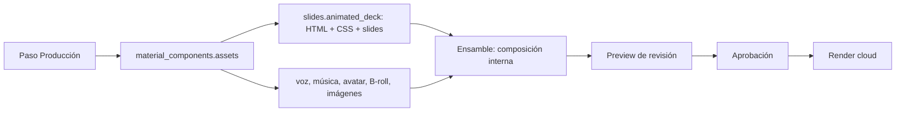

# Análisis del preview y ensamblaje de video

## Hallazgo y corrección inmediata

El `400` al crear una revisión ocurría cuando el componente no tenía filas
`production_assets` de tipo `SOURCE_MEDIA`. Un deck animado listo para preview
vive hoy en `material_components.assets.slides.animated_deck`, no en esa tabla.
Por lo tanto el flujo lo descartaba y el esquema exigía al menos un medio.

La corrección conserva el deck como fuente HTML interna: CSS, fuentes, markup,
orden de slides y contador de animaciones. Las imágenes PNG/JPG generadas por el
flujo anterior se conservan como respaldo histórico, pero no sustituyen el deck
HTML cuando éste está disponible.

## Flujo vigente de Producción

La sincronización de Ensamble sólo registra medios ya almacenados en
`production-assets`; no mueve archivos ni consume URLs arbitrarias. El deck HTML
es un input de composición separado para evitar fingir que es un JPEG/MP4.

## Estado de capacidades

| Capacidad | Estado actual | Observación |
| --- | --- | --- |
| Heredar assets del paso anterior | Implementada | Se registran medios trazables y se lee el deck HTML directamente. |
| Deck HTML animado | Corregido | Se empaqueta con CSS, fuentes y `--deck-t`; no se rasteriza para la revisión. |
| Preview previo a render | Implementado | Iframe y scrubber por segmentos de slides. |
| Timeline visible | Implementado, lectura | Se genera una pista de slides HTML y permite seek. |
| Edición persistente de timeline | Pendiente | Los overrides antiguos no se traducen ni se guardan aún en una revisión nueva. |
| Edición de layouts | Pendiente | El nuevo compositor aún usa layout base, sin inspector ni contrato de cajas. |
| B-roll/avatar/audio en timeline nuevo | Parcial | Se empaquetan como media; falta exponer sus segmentos y editores. |
| Validación antes de render | Implementada | Assets/ZIP ≤ 200 MiB y hash/checksum. |
| Render final | Pendiente de validación visual | Requiere comprobar el proyecto HTML con el runtime de render antes de aprobar el primer render real. |

## Brechas que no deben ocultarse

1. El panel anterior ofrecía edición de `timeline_overrides` y
   `layout_overrides` asociados al contrato de ensamblaje previo. El nuevo flujo
   todavía no tiene un contrato equivalente, por lo que no es correcto anunciar
   que esos controles ya están migrados.
2. El preview del navegador es una superficie de revisión. El render cloud debe
   validar el mismo ZIP y sus snapshots para demostrar paridad visual antes de
   reemplazar definitivamente la ruta anterior.
3. Un deck que contenga scripts, handlers inline o URLs `javascript:` se rechaza
   como fuente de composición. El contenido aceptado sigue siendo HTML interno
   saneado por el paso de Producción.
4. CSS basado en `--deck-t` conserva el modelo de animación usado por el deck
   existente. Animaciones dependientes de reloj, scripts o estado del navegador
   no son deterministas y requieren conversión explícita antes de renderizar.

## Siguiente implementación recomendada

1. Definir `composition_editor_manifest` versionado por revisión: tracks,
   segmentos, layout base y overrides. Debe ser inmutable una vez aprobada la
   revisión.
2. Portar el modelo de segmentos existente: audio, avatar, slides y B-roll.
   Persistir edición como patch validado, nunca mutando los assets fuente.
3. Crear inspector de layout para las cajas permitidas y guardar sus overrides
   dentro del manifest nuevo, no en los campos legacy del componente.
4. Añadir validación del ZIP con snapshots en el mismo runtime que renderizará;
   el render se habilita sólo tras preview aprobado.
5. Ejecutar una prueba de paridad con un deck real: inicio, mitad y fin de cada
   slide, comparando preview y render. Conserva la ruta anterior como rollback
   hasta cumplir los criterios de aceptación.

## Criterios de aceptación de la migración del preview

- Un deck HTML listo produce una revisión aunque no haya archivos multimedia.
- El preview muestra cada slide y permite seek a cualquier segmento.
- Ningún deck listo se convierte en JPG/PNG como requisito de ensamblaje.
- Timeline/layout se editan sólo mediante un manifest versionado y validado.
- Preview y render final producen snapshots equivalentes en los tiempos de
  prueba acordados.
- Se conserva trazabilidad de composición, revisión, fuentes, render y video
  final.
