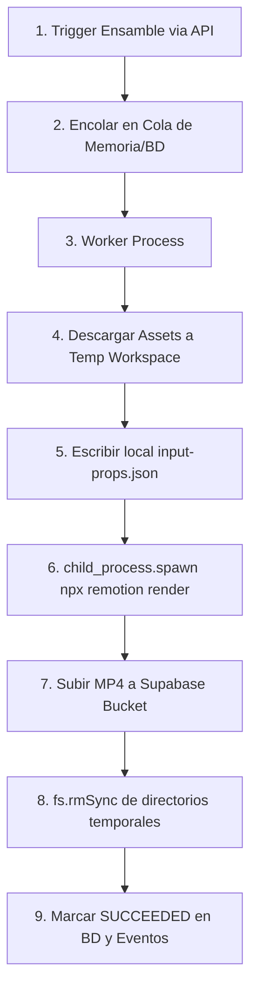

# Plan de Integración: Compilador y Renderizador Remotion (Fase 7)

Este documento detalla el diseño de arquitectura y el plan paso a paso para la implementación del motor de renderizado real de **Remotion** utilizando el **Camino A: Server-Side Local (Node.js en el backend Express)**. Esto aprovecha la infraestructura VPS fija existente, evitando costos variables de AWS y simplificando el ciclo de vida de los assets.

---

## 1. Respuestas de Arquitectura y Diseño

### 1.1. ¿Las transiciones se definen en las plantillas?
**Sí.** En Remotion, las transiciones visuales (desvanecidos, desplazamientos, zooms, cortes de cámara interpolados, etc.) se implementan directamente en el código de la plantilla utilizando:
* Animaciones nativas de React controladas por interpolaciones de frames (`spring` e `interpolate` de Remotion).
* Librerías de transiciones especializadas de Remotion (como `@remotion/transitions`).

**Personalización dinámica:**
Aunque la transición está codificada en la plantilla, esta puede exponer parámetros en su `config_schema` (por ejemplo, `{ "transitionType": "fade", "transitionDurationFrames": 30 }`). El backend inyectará estos parámetros dinámicamente como variables de entrada (`inputProps`), permitiendo cambiar el tipo de transición desde la UI sin modificar el código fuente de la plantilla.

### 1.2. ¿Cómo se manejan los subtítulos?
Los subtítulos se renderizan dinámicamente sobre la composición de video en tiempo de compilación. Para lograrlo:
1. **Generación del archivo de tiempos**: El transcriptor o alineador (Whisper/Gemini) genera una estructura de subtítulos JSON o archivo WebVTT sincronizado con el audio de voz.
2. **Inyección en Remotion**: Este archivo/JSON se pasa como un prop de entrada a la composición de Remotion.
3. **Renderizado en pantalla**: El componente de subtítulos de React lee el cuadro actual (`useCurrentFrame()`), calcula qué texto corresponde a ese frame y lo muestra con los estilos CSS (fuente, sombras, colores, micro-animaciones) configurados en la plantilla. De este modo, los subtítulos quedan quemados ("hardcoded" visualmente) en el archivo `.mp4` final.

---

## 2. Arquitectura del Runner Local (Express Backend)

El pipeline de renderizado se integrará directamente como una tarea asíncrona dentro de la aplicación backend Express (`apps/api/src`).



### 2.1. Gestión de Recursos y Concurrencia (Prevención de CPU Starvation)
La renderización de video es una tarea intensiva en CPU. Para evitar bloquear el servidor web Express y no agotar los recursos del VPS, se implementarán los siguientes controles:
1. **Cola de ejecución en paralelo limitado (Semáforo)**:
   * Se utilizará un gestor de colas en memoria (como `p-queue` o una tabla simple en base de datos actuando como cola) con una concurrencia máxima de **1 o 2 renders simultáneos** (`concurrency: 1`).
   * Los renders adicionales se mantendrán en estado `QUEUED` en la tabla `production_jobs`.
2. **Límite de núcleos (Multithreading controlado)**:
   * Por defecto, Remotion utiliza todos los núcleos disponibles. Configuraremos el comando con la bandera `--cores=X` (ej. `--cores=2` en un VPS de 4 núcleos) para dejar holgura de procesamiento a las llamadas API tradicionales del servidor.

---

## 3. Fases de Implementación Técnica en `apps/api/src`

### Fase 1: Infraestructura y Modelado de Datos

1. **Tabla de Control de Jobs (`production_jobs`)**:
   * Los trabajos se registran con `job_type = 'REMOTION_RENDER'`.
   * El estado progresa de: `PENDING` -> `QUEUED` -> `RUNNING` -> `SUCCEEDED` / `FAILED`.
   * En `input_snapshot` se guarda el `componentId`, el `templateId` y las configuraciones elegidas en la UI.
2. **Dependencias del VPS (Linux/Ubuntu)**:
   * Remotion requiere de **Chromium** y **FFmpeg** instalados en el sistema operativo del VPS.
   * Se incluirá una guía de provisión para instalar las dependencias requeridas en producción:
     ```bash
     sudo apt-get install -y ffmpeg chromium-browser
     ```

### Fase 2: Descarga Local de Assets en el Workspace Temporal

Se creará un servicio en el backend (`apps/api/src/features/production/remotion-worker.service.ts`):
1. **Crear Directorio Temporal**:
   * Directorio de compilación: `apps/api/tmp/remotion-build-{jobId}/`.
2. **Descarga de Recursos**:
   * Descargar en paralelo todos los recursos desde Supabase Storage usando streams en node-fetch hacia directorios locales:
     * `voice_audio.public_url` -> `tmp/.../assets/voice.mp3`
     * `background_music.public_url` -> `tmp/.../assets/bg_music.mp3`
     * `avatar_video.public_url` -> `tmp/.../assets/avatar.mp4`
     * Diapositivas (HTML o imágenes) -> `tmp/.../assets/slides/`
3. **Descarga de la Plantilla**:
   * Extraer el bundle de la plantilla Remotion (`storage_path` en `remotion_templates`) en la raíz del directorio temporal.

### Fase 3: Renderizado y Monitoreo del child_process

1. **Escribir Propiedades Locales**:
   * Generar `input-props.json` dentro del directorio temporal para que Remotion compile mapeando las rutas locales relativas en lugar de URLs externas.
2. **Spawn del Comando Remotion CLI**:
   * Ejecutar la compilación en un proceso hijo:
     ```typescript
     import { spawn } from 'child_process';
     
     const process = spawn('npx', [
       'remotion', 
       'render', 
       entryPoint, 
       compositionId, 
       'output.mp4', 
       `--input-data=${inputPropsPath}`,
       `--cores=2`
     ], { cwd: workspacePath });
     ```
3. **Parsing de Progreso**:
   * Leer `stdout` del proceso hijo. Remotion imprime líneas de progreso (ej. `Rendering frame 45/300 (15%)`).
   * Usar regex sencillos para extraer el porcentaje y actualizar la columna `progress` en `production_jobs` para que el frontend pueda pintar la barra de carga en tiempo real.

### Fase 4: Subida, Limpieza y Sincronización

1. **Subida del Video Final**:
   * Subir `output.mp4` al bucket `production-videos` bajo `completed/{component_id}.mp4` utilizando el SDK de Supabase.
2. **Limpieza del Workspace (FS Cleanup)**:
   * **Crítico para evitar fugas de almacenamiento**: Al finalizar (sea exitoso o fallido), ejecutar una eliminación recursiva de los temporales:
     ```typescript
     import * as fs from 'fs';
     
     if (fs.existsSync(workspacePath)) {
       fs.rmSync(workspacePath, { recursive: true, force: true });
     }
     ```
3. **Actualización de Registros**:
   * Actualizar `material_components.assets.final_video_url` con la URL pública generada.
   * Marcar el job en `production_jobs` como `SUCCEEDED` y actualizar `production_status` de la lección a `COMPLETED`.

---

## 4. Plan de Trabajo Detallado (Pasos a Seguir)

- [ ] **Paso 1**: Crear el controlador Express `apps/api/src/features/production/production.controller.ts` para exponer el endpoint `POST /api/production/remotion/render` (encola el render y retorna el `jobId` inmediatamente).
- [ ] **Paso 2**: Desarrollar el servicio `remotion-worker.service.ts` para procesar renders de la cola usando una cola en memoria con límite de concurrencia.
- [ ] **Paso 3**: Implementar la lógica del descargador local de assets (`workspace-downloader.ts`) y su proceso de limpieza `fs.rmSync`.
- [ ] **Paso 4**: Escribir la rutina de spawneo del comando `npx remotion render`, incluyendo parsing de progreso desde stdout.
- [ ] **Paso 5**: Modificar la UI del Paso 7 para consultar el estado del render (`/api/production/jobs/{jobId}/status`) mediante polling de corta duración hasta que el video esté listo.
