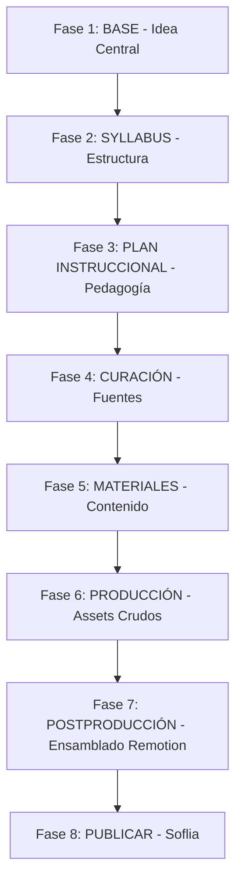
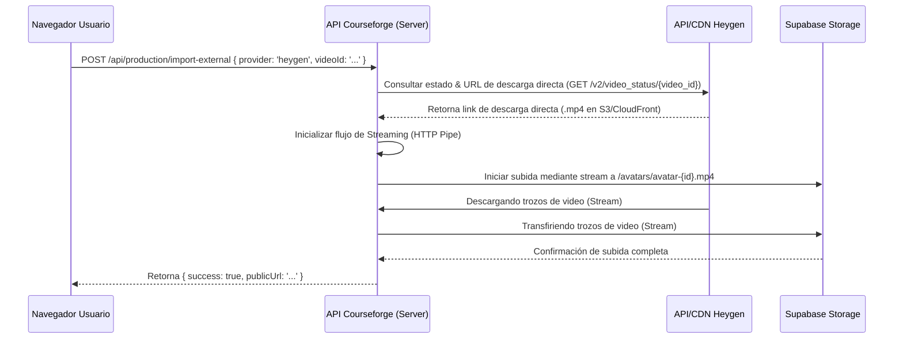

# Plan de Implementación: Reestructuración de Producción a Dos Fases (Producción de Assets y Postproducción Remotion)

Este documento detalla el plan técnico para dividir la actual fase de producción visual (Fase 6) en dos fases consecutivas e independientes: **Fase 6: Producción de Assets** y **Fase 7: Postproducción (Ensamblado Remotion)**. Esto amplía el pipeline general de Courseforge a un total de 8 fases. 

Adicionalmente, se plantea la transición de **Gamma** a **Open Design** para la creación de Slides, y la integración de un **Generador de Clips de Video (Herramienta Externa)** para la generación de clips mediante inputs optimizados, con configuración y control de prompts a nivel organización.

---

## Fases del Pipeline Courseforge (Nueva Estructura de 8 Pasos)

Con esta reestructuración, el workflow del artefacto pasa de 7 a 8 pasos lineales:



---

## Fase 1: Base de Datos y Modelo de Datos (Esquemas de Assets)

Para poder realizar un ensamblado determinista, los assets no deben ser simples strings o enlaces genéricos externos. Deben registrarse de forma estructurada en la base de datos vinculada a `material_components`.

### 1.1. Modificación en `material_components.assets`
El campo `assets` (de tipo `JSONB`) en la tabla `material_components` pasará a almacenar un esquema JSON estricto con los siguientes campos para almacenar los archivos crudos y sus metadatos asociados:

```json
{
  "production_status": "PENDING | IN_PROGRESS | COMPLETED | FAILED",
  "voice_audio": {
    "storage_path": "production-assets/voices/component-id-voice.mp3",
    "public_url": "https://...",
    "duration": 120.5,
    "provider": "elevenlabs | custom",
    "last_uploaded_at": "2026-06-04T14:42:00Z"
  },
  "background_music": {
    "storage_path": "production-assets/music/component-id-bg.mp3",
    "public_url": "https://...",
    "duration": 180.0,
    "volume_multiplier": 0.15
  },
  "b_roll_clips": [
    {
      "id": "clip-1",
      "storage_path": "production-assets/broll/component-id-clip1.mp4",
      "public_url": "https://...",
      "duration": 5.4,
      "prompt_used": "Cinematic shot. Close-up of typing on keyboard...",
      "order": 1
    }
  ],
  "avatar_video": {
    "storage_path": "production-assets/avatars/component-id-avatar.mp4",
    "public_url": "https://...",
    "duration": 120.5,
    "style": "talking-head"
  },
  "slides": {
    "open_design_project_id": "proj-12345",
    "html_content_path": "production-assets/slides/component-id-slides.html",
    "html_public_url": "https://...",
    "images": [
      {
        "slide_index": 1,
        "storage_path": "production-assets/slides/component-id-slide-1.png",
        "public_url": "https://..."
      }
    ]
  },
  "final_video_url": "https://...",
  "screencast_url": "https://..."
}
```

### 1.2. Configuración de Prompts por Organización (`system_prompts`)
Se introduce un nuevo código de prompt por defecto en la tabla `system_prompts` para la generación de inputs compatibles con el **Generador de Clips de Video** (creación de clips de b-roll).

- **Prompt Code**: `CLIP_GENERATION_PROMPTS`
- **Descripción**: Prompt del sistema para estructurar los prompts visuales de B-roll y sincronización con el guion para alimentar a Flow.
- **Campos en Base de Datos**:
  - `code`: `'CLIP_GENERATION_PROMPTS'`
  - `version`: `'1.0.0'`
  - `organization_id`: `UUID` (para multi-tenancy)

### 1.3. Reglas de Validación de Completitud (Opcionalidad de Activos)
Para evitar redundancia de costes y simplificar la producción de video:
- **Audio de Voz (Voz de Locución)**: Deja de ser estrictamente obligatorio si se detecta que ya se ha cargado/sincronizado un **Avatar IA** (`avatar_video.public_url`), dado que el avatar cuenta con su propia narración de voz nativa.
- **Sobreescritura en Remotion (Fase 7)**: Si se cargan tanto el **Avatar IA** como la **Locución (Audio de Voz)**, el compilador Remotion reemplazará/limpiará la pista de audio nativa del avatar usando el archivo de audio maestro de la locución para lograr una calidad superior de voz.

---

## Fase 2: Backend y API de Generación (Fase 6: Producción de Assets)

### 2.1. Adaptación de Netlify Functions / API Routes
1. **Cambio de Gamma a Open Design**:
   - Creación de un endpoint `/api/production/open-design/export` que toma el storyboard del componente y genera el código HTML limpio estructurado en base a una plantilla base de slides corporativas.
   - El resultado HTML se almacena temporalmente o se copia al portapapeles.
2. **Generación de Inputs para Flow (Clips)**:
   - Modificar el background job de generación de prompts visuales (`video-prompts-generation.ts`) para usar el nuevo prompt de organización `CLIP_GENERATION_PROMPTS`.
   - La respuesta del modelo Gemini (`gemini-2.0-flash`) debe retornar una estructura JSON limpia que represente los bloques de tiempo (timecodes), la transcripción exacta a locutar y el prompt visual en inglés optimizado para el Generador de Clips.

### 2.2. Manejo de Carga de Archivos Crudos
- Reutilizar `uploadWithSignedUrl` para subir directamente al storage de Supabase (bucket `production-assets` con carpetas específicas por tipo de recurso para evitar colisiones).
- El backend firmará las URLs con políticas de expiración razonables o las mantendrá públicas según sea necesario para alimentar al compilador local de Remotion.

---

## Fase 3: Frontend y UI (Paso 6: Producción de Assets)

La pantalla del Paso 6 se rediseñará para convertirse en una central de carga y verificación de assets individuales por lección/componente:

```
+--------------------------------------------------------------------------+
|  PASO 6: PRODUCCIÓN DE ASSETS                                            |
+--------------------------------------------------------------------------+
|  Lección 1: Introducción a la IA                                         |
|  [V] Audio de Voz (Voiceover)                                            |
|      -> Archivo: intro-voice.mp3 (120s)                 [Re-Subir]       |
|                                                                          |
|  [ ] Música de Fondo (Background Music)                                  |
|      -> [Subir MP3 de música]                                            |
|                                                                          |
|  [ ] Slides (Open Design)                                                |
|      -> [Copiar Estructura Open Design] [Abrir Open Design]              |
|      -> Archivo slides HTML/PNG:                        [Subir Zip/HTML] |
|                                                                          |
|  [V] Clips de B-Roll (Clips de Video)                                     |
|      -> Clip 1: (5s) typing_keyboard.mp4                [Borrar/Cambiar] |
|      -> Clip 2: (8s) brainstorm_office.mp4              [Borrar/Cambiar] |
|                                                                          |
|  [V] Avatar IA (Video Talking Head)                                      |
|      -> Archivo: avatar_intro.mp4                       [Cambiar]        |
+--------------------------------------------------------------------------+
```

### 3.1. Acciones del Portapapeles (Open Design)
Al hacer clic en "Copiar Estructura Open Design":
1. Se extraen los puntos clave y guiones del storyboard.
2. Se formatea en JSON/HTML específico para las plantillas de Open Design.
3. Se escribe al portapapeles del navegador mediante `navigator.clipboard.writeText`.
4. Se abre una pestaña nueva con el editor web de Open Design configurado.

---

## Fase 4: Frontend y UI (Paso 7: Postproducción - Ensamblado Remotion)

Este paso actuará como un contenedor para el ensamble, mostrando la interfaz preparatoria para la unión final.

### 4.1. Visualización de la Plantilla de Video
- Selección de la plantilla de video de Remotion a utilizar (ej. "Classic Slide + Avatar", "Split Screen", "Full Presentation").
- Tabla de asignación de variables de entorno para Remotion:
  - `voiceAudioUrl`: Apunta a `assets.voice_audio.public_url`
  - `bgMusicUrl`: Apunta a `assets.background_music.public_url`
  - `slidesPngs`: Apunta a `assets.slides.images`
  - `brollClips`: Apunta a `assets.b_roll_clips`
  - `avatarUrl`: Apunta a `assets.avatar_video.public_url`

### 4.2. Simulación del Ensamblado (Mocked Remotion Integration)
- Se habilitará un botón interactivo de **"Iniciar Ensamblado con Remotion"**.
- Al presionarlo, cambiará el estado del paso a `IN_PROGRESS` con un Loader animado simulando el renderizado de fotogramas.
- Finalizado el proceso simulado, el campo `final_video_url` del componente se actualizará con un enlace de prueba y se desbloqueará el Paso 8 (Publicar).

---

## Fase 5: Settings y Panel de Prompts Corporativos

### 5.1. Actualización de `SystemPromptsManager`
- Se registrará el código `CLIP_GENERATION_PROMPTS` en la lista de prompts editables en `SystemPromptsManager.tsx`.
- Se añadirá una descripción semántica: *"Define cómo la IA estructura el guion, el storyboard y las instrucciones visuales para la generación de clips B-roll a través del Generador de Clips de Video."*

---

## Fase 6: Transferencia Directa Server-to-Server (Heygen y Servicios Externos)

Para agilizar el flujo de trabajo y optimizar el uso de recursos y ancho de banda, se implementará un mecanismo que evite la descarga de archivos multimedia pesados (como los avatares generados en **Heygen**) a la computadora local del usuario para su posterior re-subida. 

### 6.1. Arquitectura de Transferencia Directa (Heygen to Supabase)
El flujo técnico se estructurará de la siguiente manera:



### 6.2. Detalles del Flujo Técnico
1. **Endpoint de Importación**: Creación del endpoint `/api/production/import-external`. Recibe el `provider` (ej. `'heygen'`), el `external_id` (o la URL de previsualización) y el `component_id`.
2. **Descarga y Subida en Streaming (Pipe)**:
   - En lugar de guardar el video en el disco local del servidor (Netlify Functions / API), se leerá la URL del CDN de Heygen en un `ReadableStream` y se enviará directamente al cliente de Supabase Storage mediante un `WritableStream`.
   - Se utilizarán firmas de petición de Heygen o headers de autenticación autorizados.
3. **Persistencia en Base de Datos**:
   - En el JSONB de assets de `material_components`, se guardará el metadato del avatar indicando el origen externo y el estado de sincronización:
     ```json
     "avatar_video": {
       "provider": "heygen",
       "external_id": "heygen-video-12345",
       "sync_status": "SYNCING | COMPLETED | FAILED",
       "public_url": "https://...",
       "storage_path": "production-assets/avatars/component-id-avatar.mp4"
     }
     ```
4. **UI/UX en el Frontend**:
   - En el panel del avatar del Paso 6, se ofrecerá la opción *"Importar desde Heygen"*.
   - El usuario introduce el ID del video o enlace público.
   - La plataforma muestra una animación de progreso *"Transfiriendo video desde Heygen... [X%]"* consultando el endpoint de estado en segundo plano.

---

## Plan de Trabajo por Fases de Desarrollo

### Fase 1: Infraestructura de Datos y Configuración
- Crear migración SQL para añadir el prompt `CLIP_GENERATION_PROMPTS` a la tabla `system_prompts`.
- Definir y validar el schema TypeScript para `material_components.assets` con Zod.
- Crear el bucket `production-assets` en Supabase Storage.

### Fase 2: Modificación del Pipeline y API de Prompts
- Implementar la lógica para copiar el JSON estructurado al portapapeles en el formato compatible con Open Design.
- Actualizar la lógica del prompt resolver en el backend para admitir `CLIP_GENERATION_PROMPTS` por organización.
- Desarrollar el endpoint de simulación para el render de Remotion.
- Desarrollar el endpoint `/api/production/import-external` para la transferencia en streaming (pipe) de archivos de video desde el CDN de Heygen hacia Supabase Storage.

### Fase 3: Implementación del Stepper y UI del Paso 6 (Assets)
- Actualizar `ArtifactWorkflowStepper.tsx` y `artifact-workflow.ts` para integrar los 8 pasos lineales.
- Construir el formulario del Paso 6 (`VisualProductionContainer` rediseñado) para permitir la carga específica de cada asset: Voz, Música, Clips, Avatar y Slides de Open Design.
- Integrar la opción de vinculación por ID/URL de Heygen y la barra de progreso de sincronización nube a nube en la tarjeta del Avatar IA.

### Fase 4: Implementación del Paso 7 (Postproducción Mocked)
- Construir el contenedor del Paso 7 para seleccionar plantillas y disparar la simulación de Remotion.
- Modificar el flujo de publicación del Paso 8 (anteriormente Paso 7) para recibir los datos actualizados del pipeline de 8 fases.

### Fase 5: QA, Pruebas y Validación
- Realizar pruebas de subida con archivos de gran tamaño.
- Validar la integración del stream Server-to-Server desde el CDN de Heygen hacia Supabase Storage y manejar timeouts de red.
- Validar las RLS (Row Level Security) para el acceso al nuevo bucket `production-assets`.
- Comprobar la resiliencia en la transición de estados de artefactos al cambiar de pasos de forma secuencial.
