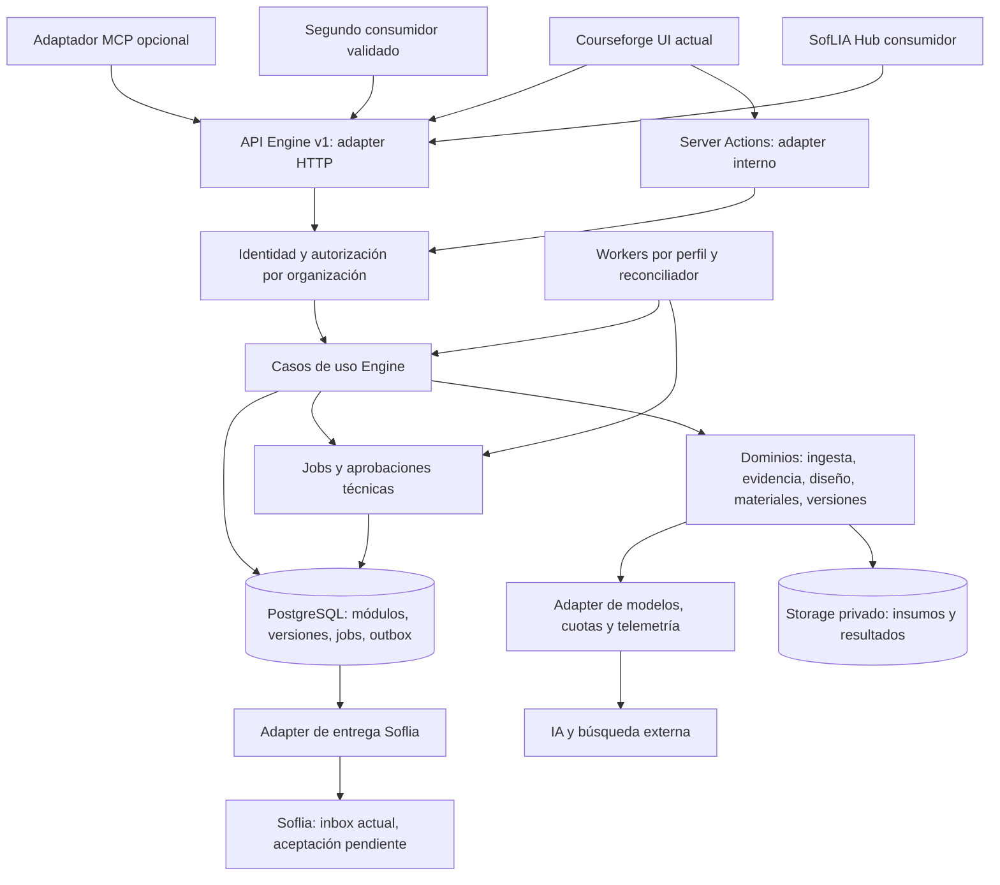
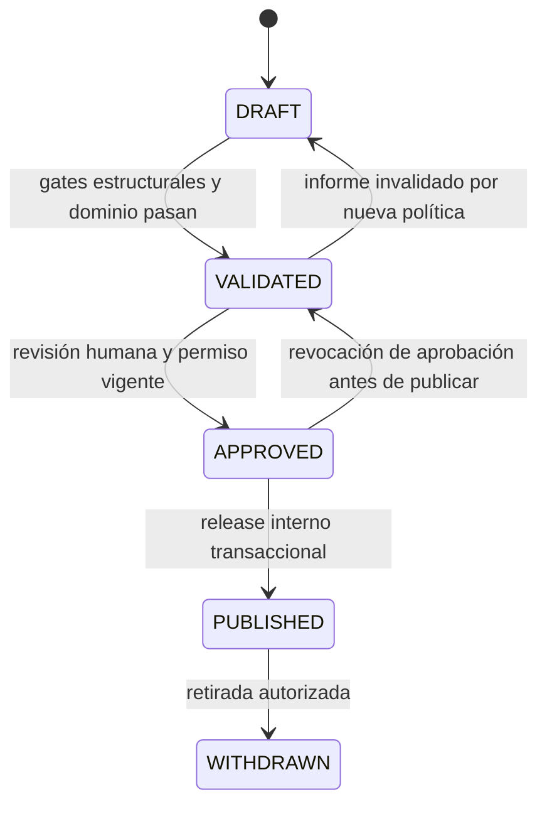
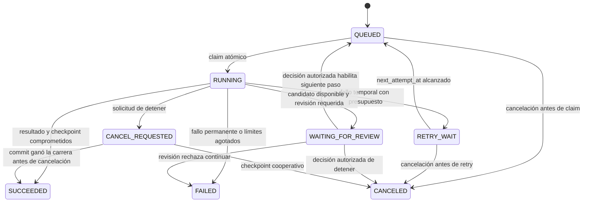

# Courseforge → SofLIA Engine: propuesta de evolución API-First

**Fecha:** 5 de octubre de 2026. **Estado:** propuesta arquitectónica para revisión; no habilita cambios operativos.

**Base de inspección:** checkout local de Courseforge, HEAD `7e16e8c3`, con cambios previos en 83 entradas rastreadas y 258 entradas no rastreadas. Los hallazgos describen el árbol de trabajo leído, no exclusivamente ese commit ni una versión desplegada. Hay migraciones con fechas posteriores a esta revisión; su presencia no demuestra aplicación.

**Alcance de esta entrega:** lectura selectiva de instrucciones, código, pruebas y migraciones; creación de este documento. No se ejecutaron aplicaciones, tests, builds, llamadas a proveedores ni consultas a bases de datos. No se leyeron archivos de valores de secretos ni se modificaron código, infraestructura o configuración. No es una auditoría completa de seguridad ni una certificación de producción.

## 1. Entendimiento del objetivo y recomendación ejecutiva

Convertir las capacidades de diseño de cursos de Courseforge en un motor consumible por la interfaz actual, SofLIA Hub y un segundo consumidor, con contratos estables, aislamiento por organización y trazabilidad de resultados. Preservar el pipeline y sus revisiones humanas durante la transición.

**Recomendación:** monolito modular TypeScript, con una capa de casos de uso independiente de Next.js, APIs versionadas y ejecución asíncrona persistente. Mantener PostgreSQL/Supabase y Netlify inicialmente donde sus límites permitan pasos recuperables. Usar workers separados para cargas que exijan otro entorno, reutilizando contratos y dominio. No empezar con una división de cada fase en microservicios.

**Piloto:** `curriculum.syllabus.generate`. Tiene valor para varios consumidores, validadores y proveedores parcialmente extraídos, y una duplicación comprobable entre ejecución local y Netlify. No exige modificar a la vez SCORM, materiales y publicación externa. El MVP debe acompañarlo con consulta de operaciones, lectura de versiones, validación, aprobación y publicación interna; la entrega a Soflia se adapta después sobre el outbox existente.

### Supuestos de dimensionamiento, no hechos del producto

- Equipo pequeño: hipótesis de 3–6 ingenieros, sin equipo dedicado a operar sistemas distribuidos.
- Decenas de trabajos simultáneos como escenario inicial de diseño, con llamadas IA de segundos a minutos y cursos completos que pueden exceder una invocación. No hay mediciones de tráfico ni duración en esta revisión.
- Presupuesto controlado; la factura de modelos, búsquedas y regeneraciones puede ser más relevante que la de HTTP. Cuotas por organización desde el MVP.
- Se conserva Next.js como interfaz y adaptador HTTP inicial. Express no se convierte en segundo propietario del mismo pipeline.
- No se promete capacidad para 100000 usuarios simultáneos. Para esa carga se necesitan pruebas, dimensionamiento de conexiones, límites de admisión y capacidad de proveedores; la modularidad por sí sola no la garantiza.

Revisar la recomendación si existen equipos autónomos, requisitos fuertes de residencia de datos, carga sostenida incompatible con PostgreSQL/Netlify o necesidades de despliegue y aislamiento independientes.

### Límites del producto

| Acción | Responsabilidad de Engine | Límite |
|---|---|---|
| Diseñar | Generar una propuesta tipada, sus alternativas, restricciones y evidencia | Una propuesta no concede permisos |
| Validar | Comprobar esquema, dominio, integridad y políticas de publicación | No demostrar automáticamente verdad o utilidad |
| Simular/evaluar | Evaluaciones acotadas sobre fixtures o escenarios, con informes | Runtime general de agentes y ejecución real de workflows fuera de alcance |
| Aprobar | Registrar decisión humana autorizada sobre versión y hash concretos | No aceptar una afirmación del agente como aprobación |
| Publicar | Liberar una versión aprobada en el catálogo de Engine | No implica aceptación por un consumidor |
| Entregar | Exportar o enviar mediante un adaptador, con estado propio | No inventar APIs de Hub, Learning o Checkup |
| Ejecutar operativamente | Ejecutar trabajos técnicos de generación, validación y entrega | Operar workflows de negocio, impartir cursos, gestionar alumnos o ejecutar Skills no pertenece al MVP |

### Significado de Skill

En esta propuesta, **Skill de agente** significa un paquete declarativo de instrucciones, entradas/salidas, ejemplos, evidencia y requisitos de permisos para un agente. No es una competencia humana ni una herramienta ejecutable. Se proponen tipos distintos:

- `competency_definition`: competencia y criterios de desempeño; hipótesis de producto.
- `knowledge_playbook`: procedimiento documentado; no tiene efectos operativos.
- `agent_skill_package`: instrucciones y manifest con permisos requeridos; inicialmente sin scripts ejecutables.
- `tool_definition`: referencia a una herramienta de otro sistema; implementarla y habilitarla corresponde a su propietario.

La generación de Skills se difiere hasta validar usuarios y formatos consumidores. Diseñar una política en un documento no aplica esa política a un runtime. La activación necesitaría una integración y autorización adicionales fuera del alcance inicial.

## 2. Diagnóstico técnico y evidencia disponible

### 2.1 Convención de evidencia

- **CP — Contexto proporcionado:** documentación del encargo/AGENTS.md; no verificación del sistema.
- **VR — Verificado en repositorio:** comportamiento o definición visible en archivos leídos. No equivale a ejecución exitosa.
- **HP — Hipótesis pendiente:** requiere pruebas, esquema efectivo, configuración desplegada, datos o confirmación del equipo.
- **R — Recomendación:** cambio de una capacidad actual o decisión arquitectónica.
- **N — Nueva capacidad:** contrato, comportamiento o entidad que esta propuesta agrega; no afirmar que ya existe.

**CP:** stack, pipeline de seis fases, SCORM, publicación Soflia y tablas suministradas. La inspección confirma partes significativas, con diferencias de ubicación y de comportamiento.

Los vínculos locales siguientes utilizan rutas absolutas del checkout inspeccionado. Las referencias tienen valor como evidencia de esta revisión, no como compromiso de estabilidad de esas rutas.

### 2.2 Hallazgos y consecuencias

| ID / clase | Evidencia concreta | Hallazgo e implicación |
|---|---|---|
| E01 / VR | [package.json](<D:/Pulse Hub/courseforge/package.json>), [web/package.json](<D:/Pulse Hub/courseforge/apps/web/package.json>), [netlify.toml](<D:/Pulse Hub/courseforge/netlify.toml>) | `dev` y `build` raíz apuntan a web; Express tiene comandos `legacy-api`. Functions se despliegan desde `apps/web/netlify/functions`. `netlify/functions` raíz y `packages/shared` no están presentes en las rutas inspeccionadas. Crear paquetes de Engine exige actualizar workspaces y build en una implementación futura; no basta trasladar archivos a una carpeta sugerida por documentación. |
| E02 / VR | [server.ts](<D:/Pulse Hub/courseforge/apps/api/src/server.ts>), [inventario privilegiado](<D:/Pulse Hub/courseforge/apps/web/src/lib/server/__tests__/privileged-background-inventory.test.ts>) | Express configura middleware y `/health`; no monta rutas de autenticación en el entrypoint leído. La prueba verifica que no se exponga auth legado. No es actualmente evidencia de un API headless del pipeline. También hay entrypoints de workers audio/video en `apps/api/src/features`; no confundirlos con rutas HTTP montadas. |
| E03 / VR | [ruta syllabus](<D:/Pulse Hub/courseforge/apps/web/src/app/api/syllabus/route.ts:321>), [worker syllabus](<D:/Pulse Hub/courseforge/apps/web/netlify/functions/syllabus-generation-background.ts:101>) | La ruta reserva generación y decide entorno. En Netlify despacha; en local investiga, genera, valida y persiste dentro de la solicitud. El worker tiene hasta tres intentos, reglas correctivas y telemetría que no aparecen en esa misma secuencia local. Existe duplicación de orquestación y divergencia; los helpers compartidos reducen duplicación, pero no unifican el caso de uso. |
| E04 / VR | [syllabus.service.ts](<D:/Pulse Hub/courseforge/apps/web/src/domains/syllabus/services/syllabus.service.ts>), [materials.service.ts](<D:/Pulse Hub/courseforge/apps/web/src/domains/materials/services/materials.service.ts>) | El servicio syllabus consume `/api/syllabus`; materiales importa Server Actions. Estar en `domains` no demuestra independencia del framework: hay fachadas de cliente y dominio mezclados por ubicación. Separar por responsabilidad real. |
| E05 / VR | [generación syllabus](<D:/Pulse Hub/courseforge/apps/web/src/domains/syllabus/lib/syllabus-generation.ts>), [proveedor syllabus](<D:/Pulse Hub/courseforge/apps/web/src/domains/syllabus/lib/syllabus-model-provider.ts>), [validadores](<D:/Pulse Hub/courseforge/apps/web/src/domains/syllabus/validators/syllabus.validators.ts>), [schema entrada](<D:/Pulse Hub/courseforge/apps/web/src/domains/syllabus/syllabus-generation-request.schema.ts>) | Existen prompts construidos por funciones, selección de proveedores, Zod de entrada y validaciones de dominio. El parser leído usa `JSON.parse`, cast y comprobación de `modules`; no es un schema completo de salida. Reutilizar funciones puras y añadir parseo de salida tipado antes de acceder a campos anidados. |
| E06 / VR | [acciones artefactos](<D:/Pulse Hub/courseforge/apps/web/src/domains/artifacts/actions/artifact.actions.ts>), [acciones plan](<D:/Pulse Hub/courseforge/apps/web/src/domains/plan/actions/plan.actions.ts>), [acciones materiales](<D:/Pulse Hub/courseforge/apps/web/src/domains/materials/actions/materials.actions.ts>) | Las acciones participan en reservas, transiciones, consultas y despacho; no son solo presentación. La extracción debe incluir transiciones y persistencia, además de prompts. `domains/plan` es la ubicación observada del plan. |
| E07 / VR | [cliente background](<D:/Pulse Hub/courseforge/apps/web/src/lib/server/background-function-client.ts>), [recuperación syllabus](<D:/Pulse Hub/courseforge/apps/web/src/domains/syllabus/lib/syllabus-generation-recovery.ts>) | En local existe importación directa de handlers, tanto awaited como fire-and-forget; reiniciar Next.js puede interrumpir ejecución. GET de syllabus puede recuperar generación detenida con una escritura condicionada por estado, iteración y timestamp. Engine debe recuperar mediante reconciliación independiente del polling del usuario. |
| E08 / VR | [tenant-context.ts](<D:/Pulse Hub/courseforge/apps/web/src/lib/server/tenant-context.ts>), [artifact-action-auth.ts](<D:/Pulse Hub/courseforge/apps/web/src/lib/server/artifact-action-auth.ts>), [sesión](<D:/Pulse Hub/courseforge/apps/web/src/utils/auth/session.ts>), [ruta publish](<D:/Pulse Hub/courseforge/apps/web/src/app/api/publish/route.ts>) | Hay Auth Bridge con `jwtVerify` HS256, cookies y contexto ligado a Next.js, consultas de roles por organización y autorización previa a operaciones privilegiadas en rutas leídas. Se usa `service_role`; RLS no es defensa efectiva para ese cliente. HP: revocación, cobertura de todas las entradas, issuer/audience y correspondencia entre JWT Bridge y claims que consume RLS. |
| E09 / VR | [RLS artefactos](<D:/Pulse Hub/courseforge/supabase/migrations/20250305000001_add_organization_to_artifacts.sql>), [RLS hijas](<D:/Pulse Hub/courseforge/supabase/migrations/20260325000001_add_org_rls_child_tables.sql>) | Estas migraciones incluyen ramas `organization_id IS NULL` por compatibilidad. Eso amplía acceso respecto de una política de aislamiento estricto. HP: efecto final al aplicar todas las migraciones y permisos. No exponer estos registros en Engine sin asignación comprobada o cuarentena. |
| E10 / VR | [firmas internas](<D:/Pulse Hub/courseforge/apps/web/src/lib/server/background-payload-signature.ts>), [guard HTTP](<D:/Pulse Hub/courseforge/apps/web/netlify/functions/shared/http.ts>), [nonces](<D:/Pulse Hub/courseforge/supabase/migrations/20260908122000_create_background_request_nonces.sql>) | Envelope HMAC con timestamp y nonce; guard consume nonce por RPC salvo invocación local reconocida. Autentica origen interno, no ownership del artefacto por sí solo. La entrega repetida del mismo envelope puede ser rechazada; recuperación debe reemitir otro envelope para el mismo trabajo persistente. |
| E11 / VR | [outbox.service](<D:/Pulse Hub/courseforge/apps/web/src/domains/publication/publication-outbox.service.ts>), [migración outbox](<D:/Pulse Hub/courseforge/supabase/migrations/20260910130000_durable_publication_outbox.sql>), [reconciliador](<D:/Pulse Hub/courseforge/apps/web/netlify/functions/publication-outbox-reconcile.ts>) | Publicación ya tiene payload congelado/hash, claim con lease, intento persistido, timeout y reconciliación cada cinco minutos. Entrega mediante upsert a `courseengine_inbox`, conflicto por `course_slug`; guarda `SENT` con inbox pendiente. No demuestra aceptación de Soflia. En los archivos leídos no se observa límite terminal/backoff de reintentos. Payload inválido o hash inconsistente se trata como reintentable: debería ir a fallo permanente/cuarentena. |
| E12 / VR | E11 | Índice de idempotencia local es global, no por organización. La finalización filtra estado/hash, pero no token de lease del intento; un intento vencido con mismo hash puede competir con otro. El upsert puede reponer `pending` tras un resultado remoto si se repite. Verificar semántica del inbox y añadir fencing y reconciliación; no prometer exactly-once. |
| E13 / VR | [jobs SCORM SQL](<D:/Pulse Hub/courseforge/supabase/migrations/20260910120000_durable_scorm_import_jobs.sql>), [parsing service](<D:/Pulse Hub/courseforge/apps/web/src/domains/scorm/services/scorm-parsing.service.ts>), [repository](<D:/Pulse Hub/courseforge/apps/web/src/domains/scorm/services/scorm-job.repository.ts>) | Existen servicios de parsing y repositorio de claim/heartbeat, con organización y lease. Son base reutilizable. En el heartbeat SQL leído no aparece token/attempt como condición; revisar el conjunto de commits de SCORM antes de afirmar exclusión de workers obsoletos. |
| E14 / VR | [commits pipeline](<D:/Pulse Hub/courseforge/supabase/migrations/20260915120000_pipeline_generation_commits.sql>), [worker materiales](<D:/Pulse Hub/courseforge/apps/web/netlify/functions/materials-generation-background.ts>), [leases audio](<D:/Pulse Hub/courseforge/supabase/migrations/20260921120000_add_audio_processing_job_leases.sql>) | Hay commits transaccionales de curación/materiales que verifican intento/versión; audio usa claim con `SKIP LOCKED`, token y expiración. Reutilizar el patrón, no afirmar que una sola abstracción de jobs ya cubre el pipeline entero. |
| E15 / VR | [validación curación](<D:/Pulse Hub/courseforge/apps/web/netlify/functions/shared/curation-v2/validation.ts>), [public-url-policy](<D:/Pulse Hub/courseforge/apps/web/src/lib/server/public-url-policy.ts>), [workflow curación](<D:/Pulse Hub/courseforge/apps/web/netlify/functions/shared/curation-v2/workflow.ts>) | HTTPS público, resolución DNS, rechazo de redes, redirect manual revalidado, timeout y presupuesto de texto existen. V2 incorpora evaluación de cobertura y múltiples rondas; no reducirla al flujo antiguo descrito. HP: todos los fetches pasan por este camino y protección frente a DNS rebinding entre validación y conexión. |
| E16 / VR | [parser SCORM](<D:/Pulse Hub/courseforge/apps/web/src/domains/scorm/services/scorm-parser.service.ts>), [pruebas parser](<D:/Pulse Hub/courseforge/apps/web/src/domains/scorm/services/__tests__/scorm-parser-security.test.ts>) | Hay presupuesto previo de entradas, bytes y compresión, y rechazo ZIP64. Se leyeron pruebas de manifiesto mínimo y ratio excesivo. No demostrar path traversal, XXE, límites reales de expansión ni sanitización de HTML solo con esas pruebas. |
| E17 / VR | [logger](<D:/Pulse Hub/courseforge/apps/web/src/lib/server/operational-logger.ts>), [telemetría IA](<D:/Pulse Hub/courseforge/apps/web/src/shared/ai/usage-telemetry.ts>), [contrato errores](<D:/Pulse Hub/courseforge/apps/web/src/lib/server/api-contract.ts>) | Existen correlation IDs, redacción de logs, eventos IA y errores seguros. También persisten `console.*` directos en partes inspeccionadas. La captura de uso es best effort; no reemplaza la reserva atómica de presupuesto. |
| E18 / VR | [tests outbox](<D:/Pulse Hub/courseforge/apps/web/src/domains/publication/__tests__/publication-outbox.test.ts>), [tests curación](<D:/Pulse Hub/courseforge/apps/web/netlify/functions/shared/curation-v2/__tests__/workflow.integration.test.ts>), [tests recuperación](<D:/Pulse Hub/courseforge/apps/web/src/domains/syllabus/lib/__tests__/syllabus-generation-recovery.test.ts>), E02/E16 | Hay pruebas valiosas, no ausencia general de QA. Algunas pruebas de inventario verifican texto de código, y las de outbox leídas cubren hash/schema/lease, no una entrega remota con fallo de commit. No se ejecutaron ni se verificó cobertura desplegada. |

### 2.3 Restricciones verificadas de entorno

Según documentación oficial consultada en esta revisión: funciones síncronas de Netlify tienen límite de 60 s, programadas 30 s y background 15 min; payload background 256 KB. Son límites del producto documentado, no una comprobación del plan o configuración de este proyecto. [Configuración de funciones](https://docs.netlify.com/build/functions/configuration/).

Background devuelve `202` antes de terminar; el resultado del handler no llega al llamador. Netlify documenta reintentos ante errores de invocación tras un minuto y luego dos minutos adicionales. Validar cómo aplica a los handlers legacy usados aquí: devolver `{statusCode: 500}` no debe suponerse equivalente a un fallo de invocación. El registro de trabajo será la autoridad. [Background Functions](https://docs.netlify.com/build/functions/background-functions/).

Las funciones programadas no corren automáticamente en Netlify Dev y operan por calendario en deploys publicados, no en previews. [Scheduled Functions](https://docs.netlify.com/build/functions/scheduled-functions/).

**Riesgo específico E03:** la entrada HTTP de syllabus admite hasta 768 KiB y despacha `sourceDocuments` inline dentro del envelope firmado/base64. Algunas entradas válidas pueden superar 256 KB al despachar. Pasar IDs y hashes de insumos almacenados, no documentos completos. Probar tamaño del envelope final, no únicamente tamaño del JSON previo.

**Riesgo E07/E10:** éxito de despacho no demuestra firma aceptada, nonce disponible ni job completado. El reconciliador debe detectar trabajos nunca reclamados y usar un nuevo nonce sin crear otra operación. El callback del proveedor tampoco debe ser autoridad para liberar una versión.

**HP pendientes:** versión y plan Netlify efectivos, límites de concurrencia, región, configuración de plugin Next.js, pool PostgreSQL, migraciones aplicadas, permisos RLS efectivos, SLOs y presupuesto. El deadline local de 120 s en [pipeline-generation-policy.ts](<D:/Pulse Hub/courseforge/apps/web/src/lib/pipeline-generation-policy.ts>) no amplía un límite del hosting.

## 3. Comparación de alternativas

### 3.1 Principios diferentes

- **Headless:** no requiere la UI de Courseforge para usar una capacidad. Permite UI actual, Hub, CLI o adaptador de agente.
- **API-First:** contratos, errores, autorización y compatibilidad son entregables previos a integrar consumidores. No equivale a envolver cualquier Server Action con HTTP.
- **Modularidad:** límites internos, invariantes y propiedad de datos claros. Puede existir en un solo despliegue.
- **Microservicios:** despliegues y operación independientes, usualmente con propiedad separada de datos. Añaden red, fallos parciales y consistencia distribuida.
- **Asíncrono:** aceptar trabajo y consultar resultado después. Puede implementarse dentro de un monolito con workers; no requiere microservicios.

### 3.2 Evaluación para los supuestos iniciales

| Criterio | A. Monolito modular + APIs/workers | B. Microservicios desde el inicio | C. Híbrida con extracción progresiva |
|---|---|---|---|
| Correctitud/seguridad | Invariantes y transacciones locales; riesgo de credencial privilegiada amplia | Aislamiento potencial, pero múltiples autorizaciones, secretos y fallos parciales | Mantener núcleo consistente y aislar riesgos demostrados |
| Velocidad | Alta: reusar tipos, validadores y DB | Baja: contratos internos, despliegues y soporte adicionales | Alta al inicio; extracción posterior con inversión específica |
| Mantenibilidad/tests | Tests de casos de uso y adapters; requiere reglas de imports | Contratos entre servicios y entornos de integración más caros | Tests locales más contratos en fronteras extraídas |
| Datos/consistencia | Un PostgreSQL, ownership por módulo; ACID donde corresponde | Evitar DB compartida writable; sagas/compensaciones | DB núcleo única y propiedad separada solo al extraer |
| Escala | Workers por perfil separados del HTTP; límites DB/proveedores explícitos | Escala independiente, coste de comunicación y operación | Escalar workers primero; mover módulo cuando exista cuello medido |
| Costos | Menos infraestructura fija; control IA común | Infra fija/observabilidad/red mayores; IA no abarata por dividir | Costos crecientes solo con beneficio verificable |
| Operación | Runbooks de jobs, leases, proveedores y DB | Más on-call, colas, deploys y reconciliación | Complejidad selectiva, riesgo de fronteras temporales |
| Observabilidad | Correlation ID común y menos saltos | Trazas distribuidas indispensables | Trazas habilitadas antes de extraer |
| Migración | Adapters alrededor de flujos existentes | Riesgo alto por cambios simultáneos | Mejor convivencia, con contratos como frontera |

**Elección:** A como implementación inicial; C como estrategia de evolución. B solo sería preferible con evidencia de equipos/seguridad/escala independiente que hoy no está disponible. Un worker en otro proceso no convierte automáticamente su dominio en microservicio.

### 3.3 Registro de decisiones

| Decisión | Problema y evidencia/supuesto | Alternativa y motivo de elección | Costo/riesgo | Condición para revisar |
|---|---|---|---|---|
| D1. Núcleo modular compartido | E03–E06: reglas acopladas y dos orquestaciones | No reescribir ni repartir fases; extraer un caso de uso | Ajustar build, imports y tests sin alterar comportamiento | Módulos con equipos/cadencias realmente independientes |
| D2. Jobs en PostgreSQL inicialmente | Ya hay claims/outbox/leases, E11–E14 | No introducir broker al inicio; misma transacción registra intención | Polling/contención, requiere índices, fairness y janitor | Espera en cola excede objetivo acordado, contención medida o volumen supera pruebas de capacidad |
| D3. API Next.js como adapter inicial | E01/E02: despliegue web actual, Express no expone pipeline | Evitar mantener dos APIs con reglas duplicadas | Deploy compartido y dependencia del hosting en transporte | API requiere disponibilidad/cadencia/escala independiente de UI |
| D4. Versión sellada + aprobación por hash | Estados actuales no demuestran snapshot integral aprobado | No usar fila mutable y booleano `approved` | Copias, retención y mapeo legacy | Solo revisar almacenamiento físico; no debilitar vínculo de aprobación |
| D5. Identidad y contexto explícitos | E08/E09: cookies/framework y service_role | Adaptar Bridge; no confiar en org del body ni delegar todo a RLS | Resolver membership/roles y probar revocación | Servicio compartido de identidad validado sustituye Bridge mediante puerto |
| D6. Publicar separado de entregar | E11: `SENT` deja inbox pendiente | Publicación local ACID, entrega eventual; no transacción distribuida | UI debe mostrar dos estados; consumidor debe confirmar recepción | Contrato remoto con recibos y dedupe verificados |
| D7. IA como puerto con presupuesto | E05/E17: proveedores y uso ya existen | No gateway de modelos independiente de inmediato | Congelar configuración, fallback acotado y costes inciertos | Varios productos requieren gateway común con propietario y SLO |
| D8. MCP después de API | Contrato multi-tenant todavía no verificado para agentes | Adaptador fino; no pipeline específico de Codex | Auth delegada y compatibilidad de cliente pendientes | Segundo consumidor requiere MCP y pruebas de conformance pasan |
| D9. Human–AI/Skills fuera del MVP de extracción | Hipótesis de ampliación, no capacidades verificadas | Primero contratos de cursos; después tipos nuevos explícitos | Retrasa amplitud de producto, reduce riesgo de runtime implícito | Usuario piloto, formato y rúbrica de calidad definidos |

### 3.4 Extracciones candidatas y condiciones verificables

| Candidato | Condición que justifica extracción | Primer paso de menor costo |
|---|---|---|
| Render/audio/ingesta pesada | CPU/RAM/binaries o duraciones exceden hosting; aislamiento de archivos no confiables | Worker por perfil fuera de Netlify usando contratos actuales; no migrar todo el dominio |
| Fetch/validación de fuentes | Exigir egress controlado y resolver/pinning fuera del entorno general, o incidentes/volumen afectan generación | Proceso restringido y puerto de fetch con tests SSRF |
| Entrega a consumidores | Fallos remotos degradan núcleo o equipo de integraciones despliega independientemente | Worker de outbox separado; datos de releases permanecen en núcleo |
| Acceso a modelos | Varios productos, restricciones de datos y equipo propietario/SLO independiente | Puerto y librería compartida; luego gateway si hay necesidad |
| API de Engine | Latencia/availability del API afectada por UI o despliegues de UI bloquean consumidores | Mover composición/adapters a proceso propio, mismo dominio |

Antes de extraer: métricas del problema, propietario, contrato versionado, ownership de datos, runbook, pruebas de fallo parcial y costo operativo estimado. No extraer solamente por «crecimiento futuro».

## 4. Arquitectura propuesta y diagrama



El diagrama muestra responsabilidades lógicas. DB→delivery representa lectura/reclamación del outbox por un worker, no una llamada iniciada por PostgreSQL. Los procesos concretos pueden compartir despliegue inicialmente.

### 4.1 Organización futura del código

Estructura **propuesta**, no carpetas existentes:

```text
packages/engine-contracts/       # DTOs públicos, Zod/JSON Schema, OpenAPI, errores
packages/engine-core/
  curriculum/                   # dominio y casos de uso del piloto
  evidence/                     # normalización, linaje, criterios
  artifacts/                    # versiones, validación, aprobación, releases
  operations/                   # estados y políticas técnicas de jobs
  ports/                        # repositories, identity, model, storage, clock
packages/engine-adapters/
  postgres/ models/ storage/ delivery/
apps/web/                       # UI, rutas y Server Actions existentes
apps/engine-worker/             # solo si se requiere proceso dedicado
```

No mover en bloque todos los directorios `domains`. Extraer funciones puras primero; las fachadas cliente conservan su responsabilidad y ubicación hasta un cambio justificado. Configurar workspaces explícitamente, dado E01. Evitar `engine-core` como nuevo archivo gigante: módulos con API interna pequeña y un composition root externo.

**Dependencias:** dominio solo depende de tipos propios y puertos; adapters dependen del dominio. Prohibir `next/*`, React, cookies, Supabase concreto y SDKs de proveedores dentro del núcleo mediante lint/checks de imports. No imponer DDD completo ni CQRS distribuido para este MVP.

### 4.2 Una sola implementación de reglas

- API Route: verificar autenticación, tamaño, schema y contexto; invocar `StartSyllabusGeneration`; serializar DTO. No construir prompts ni persistir módulos directamente.
- Server Action: convertir FormData y sesión en el mismo input/contexto; invocar el mismo caso de uso. `revalidatePath` permanece en adapter UI.
- Express, si se adopta posteriormente: usar el mismo contrato y resolver de contexto; no copiar handlers Next.js. Hoy no se agrega un servidor nuevo.
- Worker: reclamar `operation_id`, cargar insumos/configuración congelados y ejecutar `ExecuteSyllabusGeneration`. No aceptar tenant/rol arbitrario del mensaje como autorización.
- Netlify Function: verificar envelope y cargar job persistente; llamar al mismo executor y guardar transición. La firma solo permite solicitar procesamiento.
- UI: leer proyecciones compatibles; nunca enviar estados aprobados o políticas operativas como hechos autorizados.

Los casos de uso de inicio y ejecución son distintos, pero pertenecen a una sola implementación del comportamiento de syllabus. El ejecutor comparte esquema, validadores, prompts y política de intentos en todos los entornos.

## 5. Matriz de módulos y responsabilidades

### 5.1 Propiedad y prioridad

| Módulo | Clasificación/capacidades actuales | Propósito / responsabilidades excluidas | Datos y fuente de verdad | Prioridad |
|---|---|---|---|---|
| Ingesta y normalización | Existente, requiere desacoplamiento: SCORM y documentos syllabus (E13/E16/E05) | Insumos normalizados, manifests, extracción; no ejecutar HTML/JS SCORM ni operar un LMS | `scorm_imports/resources` actuales; nuevos registros de insumos y hashes; binarios en storage privado | MVP: documentos del piloto y convivencia SCORM; extracción completa SCORM siguiente |
| Investigación, fuentes y evidencia | Existente, requiere desacoplamiento: research base/syllabus, curación V2 | Buscar, verificar técnicamente y registrar evidencia; no tratar una URL válida como verdad | `curation/curation_rows`, snapshots de evidencia por versión; source hash/fecha/estado | MVP: linaje syllabus; API de curación siguiente |
| Diseño curricular/instruccional | Existente, requiere desacoplamiento: base, syllabus, plan | Objetivos, módulos, OA y componentes; no impartir clases ni asignar alumnos | Tablas actuales como workspace editable; versión `course_design` como resultado sellado | MVP syllabus; base/plan siguiente |
| Materiales | Existente, requiere desacoplamiento: lecturas, quiz, diálogo, ejercicios y guiones | Generar componentes desde diseño/evidencia aprobables; no asegurar entrega de videos por generar guion | `materials/material_lessons/material_components`; snapshots tipados por componente | Mantener existente; API siguiente |
| Producción de activos | Existente en pipeline/documentación y archivos de jobs inspeccionados parcialmente | Slides, render y activos vinculados por hash/estado; no ampliar editor/render en esta propuesta | Activos y jobs existentes; manifest de activos de versión | Conservar sin migración masiva; integración por contrato siguiente |
| Diseño Human–AI | Nueva capacidad propuesta | Especificar actores, tareas, handoffs, permisos requeridos, puntos de aprobación y evidencia; no ejecutar workflow empresarial | Tipo nuevo `human_ai_workflow_spec`, schema propio | Siguiente solo con caso piloto validado |
| Playbooks y Skills | Nueva capacidad propuesta | Producir paquetes declarativos con dependencias y pruebas propuestas; no conceder permisos o instalar código | Tipos `knowledge_playbook/agent_skill_package`; catálogo de schemas | Diferido |
| Validación/evaluación | Validadores deterministas existentes reutilizables; servicio de informe por versión nuevo | Validar estructura/domino y evaluar calidad; no sustituir aprobación humana o autorizar herramientas | `validation_results`, rúbricas versionadas, fixtures; conservar informes legacy | MVP estructural/domino; evaluación IA acotada siguiente |
| Versionado/publicación | Entrega Soflia existente requiere desacoplamiento; catálogo/versiones integrales nuevos | Sellar versiones, aprobar, liberar/retirar y solicitar entrega; no configurar LMS ni asumir aceptación remota | `artifact_versions/approvals/releases/deliveries` nuevos + `publication_requests` legacy | MVP interno; adapter Soflia siguiente |
| Jobs y aprobaciones técnicas | Claims/outbox/commits existentes reutilizables; contrato uniforme nuevo | Trabajos de generación/validación/entrega y esperas por revisión; no runtime general de workflows/agentes | `operations/attempts/checkpoints` nuevos, puentes a jobs legacy | MVP mínimo persistente; robustecimiento transversal progresivo |

### 5.2 Contratos internos y reglas de cada módulo

| Módulo | Entrada → salida | Invariantes / validación | Dependencias permitidas | Determinismo, IA e intervención humana |
|---|---|---|---|---|
| Ingesta | Storage ref tenant + tipo + hash → documento normalizado/manifest + findings | Ownership, budgets, rutas seguras, tipo real, hash; ningún archivo activo se ejecuta | Storage, parsers aislados, repo de insumos | Parsing/normalización deterministas; enriquecimiento IA separado; humano resuelve gaps |
| Evidencia | Objetivos + refs → fuentes verificadas y relaciones claim→source | URL segura, sin duplicados, accesibilidad, fecha; etiquetas `verified/unverified/rejected` no ambiguas | Fetch seguro, búsqueda/modelos, storage, repo propio | Normalización/checks deterministas; búsqueda/relevancia IA; humano decide idoneidad crítica |
| Diseño | Versión base + objetivos + evidencia + política → diseño candidato tipado | IDs estables, OA enlazados, límites curriculares configurados, duración y cobertura; schemas explícitos | Evidencia por puerto, modelos, repos diseño/versiones | Cálculo/checks deterministas; generación IA; aprobación/revisión humana |
| Materiales | Diseño versionado + evidencia aceptada + selección → componentes candidatos | Cobertura y tipos esperados, respuestas quiz válidas, fuentes trazables, HTML sanitizado, assets compatibles | Diseño/evidencia vía interfaces, modelos, storage | Validadores deterministas; contenido IA; QA humano por paquete/componente |
| Producción | Guion/storyboard versionado + manifest → refs de activos y pruebas técnicas | Integridad, ownership y relación a versión; assets faltantes bloquean release que los requiera | Storage, proveedores render, jobs por perfil | Checks de media deterministas; IA visual según adapter; humano revisa resultado; sin nueva función multimedia aquí |
| Human–AI | Problema, actores y restricciones → especificación propuesta | Actor/tarea referenciados, gates explícitos, permisos mínimos propuestos, criterios observables; marcar conflictos | Registro de schemas, modelos, evidencia | Graph checks deterministas; propuesta IA; aprobación humana; simulación limitada y separada |
| Playbooks/Skills | Especificación/evidencia → paquete declarativo + manifest | Tipo inequívoco, dependencias/inputs/outputs definidos, sin scripts en primer formato, permisos declarados no efectivos | Schema registry, modelos, evidencia, storage | Validación determinista; redacción IA; revisión por propietario; activación excluida |
| Validación/evaluación | Versión sellada + ruleset/fixture refs → informe por hash | Informe ligado a contenido/ruleset, findings con severidad, no autoaprobar, separar evaluar de reparar | Schemas, validadores de módulos, evaluador IA opcional | Structural/domain deterministas; calidad IA no determinista; humano adjudica criterios subjetivos |
| Versiones/publicación | Candidate hash + validación + decisión → versión/release/delivery ref | Ninguna aprobación viaja al cambiar contenido; release requiere gates/roles vigentes; rechazo no borra historial | Repos propios, autorización, storage, outbox, adapters entrega | Transiciones/hashes deterministas; sin IA que conceda aprobación; humano requerido |
| Jobs | Capability + input/config snapshot → operación/resultado | Tenant inmutable, lease fencing, budgets, checkpoints, transiciones legales, idempotencia | Repos jobs, clock, executor registrado, telemetría | Estado/retries deterministas; la IA vive en caso de uso; espera humana sin ocupar worker |

### 5.3 Capacidades transversales y consumidores

| Capacidad | Clasificación | Contrato/ownership |
|---|---|---|
| Identidad y membership | Responsabilidad de servicio compartido; hoy adapter Bridge | Engine valida principal y memberships; no diseñar IAM corporativo nuevo |
| Autorización de capacidades y ownership | Responsabilidad obligatoria de Engine con políticas compartidas | Decisión central usada por HTTP, actions y workers; permisos específicos por capability |
| Storage, acceso a modelos, cuotas, secretos, logs | Transversales; adapters locales iniciales, compartibles si existe propietario | No crear microservicios para cada utilidad; contracts de límites, datos y disponibilidad |
| Navegación, chat UX, formularios, elección de vistas y polling | Responsabilidad de consumidor | Hub y Courseforge presentan estados/acciones usando contratos; no reproducen reglas de aprobación |
| Desarrollo de capacidades, evaluaciones y rutas | Nuevas propuestas parcialmente apoyadas por diseño curricular/quiz | Diseñar artefactos posible en etapa posterior; seguimiento longitudinal de personas corresponde a consumidor |
| Learning/Checkup | Consumidores potenciales | Sin API inventada; validar necesidad y formato antes de adapter |
| Runtime general de agentes, workflow operativo, LMS y ejecución de herramientas | Fuera de alcance | Engine solo describe y libera artefactos; otro propietario controla ejecución |

## 6. Catálogo de capacidades y contratos

Todos los nombres, rutas y DTOs de esta sección son **propuestos (N/R)**, no endpoints existentes. Base provisional `/api/engine/v1`; mantener `/api/syllabus` y demás rutas como adapters legacy durante convivencia. No desplazar las rutas `v1/production` existentes.

### 6.1 Políticas comunes obligatorias

**Contexto:** resolver `principal_id`, `actor_type`, `organization_id`, permisos y eventual `delegator_id` desde identidad autenticada, membership y delegación vigente. El cliente puede seleccionar organización por ruta/header, pero el servidor confirma pertenencia; el body no constituye prueba. El job guarda contexto autorizado y nunca cambia de tenant. Revalidar autorización para inicio, lectura, cancelación, aprobación, publicación y efectos externos.

**Permisos propuestos:** `artifact:read`, `syllabus:generate`, `artifact:validate`, `artifact:approve`, `artifact:publish`, `delivery:create`, `operation:cancel`, `input:upload`. Mapear roles actuales a permisos con fixtures reales antes de activar. Agentes por defecto pueden proponer/generar/consultar, sin aprobar ni publicar autónomamente.

**Idempotencia de mutaciones:** header `Idempotency-Key`, 1–128 caracteres seguros. Scope compuesto `(organization_id, authorized_client_id, capability, target_id, key)`. Request hash canónico incluye versión API/schema, versión padre, inputs y opciones; no tokens ni correlation ID. Una misma clave/hash devuelve la operación/respuesta original; diferente hash devuelve `409 IDEMPOTENCY_CONFLICT`. Un unique constraint arbitra carreras. Autorización se comprueba incluso al recuperar una respuesta almacenada. Retención provisional de claves: 30 días para generación, dedupe persistente ligado al release para publicación/entrega; validar ventana con consumidores. Un presupuesto agotado no justifica nueva clave para eludir cuota.

**Versiones distintas:** API `/v1`; capability `curriculum.syllabus.generate@1`; schema `course_design.syllabus/1`; contenido `artifact_version` creciente; prompt ID + versión + hash de plantilla resuelta; modelo proveedor + ID efectivamente usado + revisión del proveedor si está disponible; ruleset y configuración con hash. No inventar revisión de un modelo alias ni prometer reproducibilidad bit a bit. Cambio de prompt/modelo no rompe por sí mismo la API, pero puede cambiar calidad y exige evaluación.

**Errores:** `400` JSON inválido, `413` tamaño, `415` MIME, `422` insumos que no satisfacen dominio, `401` sin identidad, `403` permiso, `404` recurso no accesible, `409` precondición/estado/idempotencia, `412` ETag desactualizado, `429` rate/concurrency quota temporal, `503` dependencia temporal. Cuota financiera agotada: error seguro `BUDGET_EXCEEDED` no reintentable automáticamente. No exponer SDK response, URL sensible, stack trace ni existencia cross-tenant.

**Compatibilidad:** OpenAPI/JSON Schema y fixtures por capability. DTOs de request estrictos; respuestas toleran nuevos campos opcionales en clientes, no cambiar significados ni tipos. Estados nuevos requieren contrato/capability negociado, no añadirse inadvertidamente a un enum exhaustivo de v1. Mantener ventana de deprecación acordada y medir uso legacy.

### 6.2 Catálogo acotado

| Capacidad / prioridad | Propósito, consumidor y caso de uso | Input → output / precondiciones | Auth / modo | Idempotencia, errores, retries y cancelación | Aprobación / compatibilidad |
|---|---|---|---|---|---|
| `inputs.register@1` / MVP piloto | Registrar documento privado; UI/Hub | Upload ref/hash/MIME → input ref; objeto existente, tenant y tamaño válidos | `input:upload`; sync metadata, normalización async si pesada | Clave scope común; 413/415/422 permanentes; retry transporte; borrar registro no cancela job que ya lo usa | Sin aprobación; schema `input/1`; almacenamiento privado |
| `curriculum.syllabus.generate@1` / piloto MVP | Diseño curricular; UI/Hub/segundo consumidor | Parent version + source refs + ruta + instrucciones → operation; padre accesible, base mínima validada, fuentes cuando ruta A | `syllabus:generate`; async en todos los entornos | Clave común; 409 parent activo/conflicto, 422 fuentes faltantes; retry transient con presupuesto; cancel cooperativo | Resultado candidato no aprobado; schema syllabus/1 |
| `operations.read@1` / MVP | Estado/progreso/resultados; todos | ID → DTO job; solo tenant autorizado | `artifact:read` y acceso al target; sync | GET idempotente; 404/503; polling con backoff; sin cancel implícito | Sin aprobación; ETag y Retry-After |
| `operations.cancel@1` / MVP | Detener generación/validación técnica; iniciador autorizado/admin | ID + razón segura → flag/estado; no terminal | `operation:cancel` + ownership/regla tenant; sync aceptación | Idempotente por operación; 409 ya comprometido/efecto irreversible; nunca retry externo por cancelar | No cancela publicaciones entregadas; estado v1 explícito |
| `artifacts.version.read@1` / MVP | Recuperar snapshot y evidencia; todos | ID/version/projection → manifest/content refs; fuente y resultados propios | `artifact:read`; sync, binarios via URLs firmadas | GET idempotente; 404/503; no generación como efecto de lectura | Schema/content versions explícitos; contenido sellado |
| `artifacts.version.validate@1` / MVP | Crear informe sobre candidato; QA/UI/servicios | ID/version/hash + ruleset → operation/report; candidate sellado | `artifact:validate`; async si evaluación IA, checks breves en executor | Dedupe version/hash/ruleset/eval-config; invalid input permanente; IA transient acotado; cancel deja informe incompleto no habilitante | No aprobación automática; ruleset versionado |
| `artifacts.version.approve@1` / MVP | Decisión humana; UI/Hub | ID/version/hash/report + decision → approval; gates pasados y ETag vigente | `artifact:approve`, humano verificado; sync | Clave común; 409 blockers/412 cambios; retry solo transporte con clave; no cancel, revocar por comando auditable | Aprueba versión exacta; no heredar tras edición |
| `artifacts.version.publish@1` / MVP | Liberar versión en Engine; UI/Hub | ID/version/hash/approval → release; aprobación vigente, tipo publicable, gates actualizados | `artifact:publish`; sync transacción breve | Dedupe release/version/channel; 409 approval invalid; retry con clave; retirada separada | Humano/servicio con instrucción explícita autorizada y approval; no IA autónoma |
| `deliveries.create@1` / siguiente | Entregar release a Soflia; UI/servicio permitido | release ref + adapter target → delivery operation; consumer contract configurado | `delivery:create`; async | Dedupe release/consumer/delivery revision; timeout→reconcile; errores 4xx permanentes salvo clasificación; cancel solo antes del envío | Release aprobado/publicado; aceptación consumidor independiente |

Capacidades posteriores: `course.base.generate`, `instructional_plan.generate`, `sources.curate`, `materials.generate`, `scorm.import`, `human_ai.design` y `agent_skill.propose`. No habilitarlas por declararlas aquí; cada una necesita contrato, autorización, costo, rúbrica y dueño. Las primeras cinco reutilizan implementación existente; las últimas dos son nuevas.

### 6.3 JSON representativo: iniciar generación

`POST /api/engine/v1/operations`. Headers: `Authorization: Bearer <token>`, `Idempotency-Key: syllabus-client-001`, `X-Correlation-ID: 7d55e249-f13e-4bcb-ae3b-6982f96071f0`. Los IDs y fechas siguientes son ilustrativos.

```json
{
  "capability": "curriculum.syllabus.generate",
  "capability_version": "1",
  "artifact_id": "550e8400-e29b-41d4-a716-446655440000",
  "parent_artifact_version": 3,
  "expected_parent_hash": "sha256:aaaaaaaaaaaaaaaaaaaaaaaaaaaaaaaaaaaaaaaaaaaaaaaaaaaaaaaaaaaaaaaa",
  "input": {
    "route": "A_WITH_SOURCE",
    "source_refs": [
      {
        "input_id": "2d4f17b5-5ecf-4dc4-87e3-9288670e1aca",
        "hash": "sha256:bbbbbbbbbbbbbbbbbbbbbbbbbbbbbbbbbbbbbbbbbbbbbbbbbbbbbbbbbbbbbbbb"
      }
    ],
    "revision_instructions": "Priorizar ejercicios de aplicación para analistas."
  },
  "options": { "generation_policy_id": "curriculum-default-v1" }
}
```

Idea/objetivos se leen de la versión padre; no confiar en duplicados divergentes del body. La política es un ID permitido para ese tenant, no nombres arbitrarios de modelos, precios o credenciales. Prompt override sigue disponible en adapter legacy donde proceda; la API nueva requiere permiso de administración y versión/hash auditables para overrides.

`202 Accepted`, con `Location` al job y `Retry-After` de polling:

```json
{
  "api_version": "1",
  "operation_id": "21a99a1c-e162-4e09-8f51-faf1750b62c3",
  "artifact_id": "550e8400-e29b-41d4-a716-446655440000",
  "artifact_version": null,
  "parent_artifact_version": 3,
  "correlation_id": "7d55e249-f13e-4bcb-ae3b-6982f96071f0",
  "state": "QUEUED",
  "phase": "pending",
  "created_at": "2026-10-05T16:00:00Z",
  "idempotency": {
    "key": "syllabus-client-001",
    "scope": "organization/client/capability/target",
    "replayed": false
  },
  "links": { "status": "/api/engine/v1/operations/21a99a1c-e162-4e09-8f51-faf1750b62c3" }
}
```

La versión resultado se asigna al sellar candidato dentro de una transacción; no reservar números visibles que parezcan contenido existente. Conflicto al cambiar padre durante el trabajo: conservar resultado como candidato basado en padre 3 y marcar `STALE_PARENT`, bloquear promoción automática.

### 6.4 JSON representativo: estado y progreso

`GET /api/engine/v1/operations/{operation_id}`:

```json
{
  "operation_id": "21a99a1c-e162-4e09-8f51-faf1750b62c3",
  "capability": "curriculum.syllabus.generate",
  "capability_version": "1",
  "artifact_id": "550e8400-e29b-41d4-a716-446655440000",
  "artifact_version": null,
  "correlation_id": "7d55e249-f13e-4bcb-ae3b-6982f96071f0",
  "state": "RUNNING",
  "phase": "generation",
  "attempt": 1,
  "progress": {
    "completed_phases": ["inputs_resolved", "research"],
    "current_phase": "generation",
    "remaining_phases": ["structural_validation", "domain_validation", "commit"]
  },
  "created_at": "2026-10-05T16:00:00Z",
  "started_at": "2026-10-05T16:00:03Z",
  "updated_at": "2026-10-05T16:00:40Z",
  "completed_at": null,
  "cancel_requested_at": null,
  "result_refs": [],
  "error": null
}
```

Sin porcentaje ni ETA inventados. Contadores `completed_items/total_items` solo cuando el total se conoce y su unidad está definida. Terminar `SUCCEEDED` implica resultados persistidos y consultables; no aprobación humana.

Error seguro representativo dentro de job o respuesta API:

```json
{
  "code": "PROVIDER_TIMEOUT",
  "message": "El proveedor no respondió dentro del plazo de esta etapa.",
  "retryable": true,
  "next_retry_at": "2026-10-05T16:02:00Z",
  "correlation_id": "7d55e249-f13e-4bcb-ae3b-6982f96071f0"
}
```

`retryable` clasifica el fallo, no autoriza al consumidor a lanzar duplicados: consulta el job; Engine gestiona intentos. Agotados intentos/deadline/presupuesto: `FAILED`, sin nuevo retry programado.

### 6.5 JSON representativo: versión con evidencia

`GET /api/engine/v1/artifacts/{id}/versions/4?projection=manifest` devuelve refs internas resolubles por el mismo API y autorizadas otra vez al descargarlas. `projection=content` devuelve el contenido con su schema completo; no un JSON sin contrato.

```json
{
  "artifact_id": "550e8400-e29b-41d4-a716-446655440000",
  "artifact_version": 4,
  "artifact_type": "course_design",
  "schema_version": "course_design.syllabus/1",
  "state": "VALIDATED",
  "content_hash": "sha256:cccccccccccccccccccccccccccccccccccccccccccccccccccccccccccccccc",
  "content_ref": "/api/engine/v1/artifacts/550e8400-e29b-41d4-a716-446655440000/versions/4/content",
  "parent_artifact_version": 3,
  "created_by_operation_id": "21a99a1c-e162-4e09-8f51-faf1750b62c3",
  "correlation_id": "7d55e249-f13e-4bcb-ae3b-6982f96071f0",
  "created_at": "2026-10-05T16:03:00Z",
  "evidence": [
    {
      "evidence_id": "768db8a8-af8e-45f5-877e-4a79d97cd784",
      "kind": "source_document",
      "input_id": "2d4f17b5-5ecf-4dc4-87e3-9288670e1aca",
      "source_hash": "sha256:bbbbbbbbbbbbbbbbbbbbbbbbbbbbbbbbbbbbbbbbbbbbbbbbbbbbbbbbbbbbbbbb",
      "verification_state": "VERIFIED",
      "verification_scope": "extraction_and_hash",
      "claim_refs": ["module:mod-1/objective"],
      "checked_at": "2026-10-05T16:00:10Z"
    }
  ],
  "validation": {
    "validation_id": "d1575c0e-3fc3-4c7a-8bb4-dcd1ad156372",
    "ruleset_version": "syllabus-domain/1",
    "structural": "PASS",
    "domain": "PASS",
    "quality_review": "PENDING",
    "publication_blockers": ["HUMAN_REVIEW_REQUIRED"]
  },
  "generation": {
    "provider": "gemini",
    "model_id": "configured-model-id-recorded-at-execution",
    "provider_model_revision": null,
    "prompt_id": "syllabus",
    "prompt_version": "recorded-resolved-version",
    "prompt_hash": "sha256:dddddddddddddddddddddddddddddddddddddddddddddddddddddddddddddddd",
    "configuration_hash": "sha256:eeeeeeeeeeeeeeeeeeeeeeeeeeeeeeeeeeeeeeeeeeeeeeeeeeeeeeeeeeeeeeee"
  },
  "approval": null,
  "release": null
}
```

`VERIFIED` aquí verifica extracción/hash, no verdad semántica. `VALIDATED` significa gates automáticos superados; sigue pendiente revisión humana. La revisión se guarda explícitamente y permite emitir aprobación, no se elimina el blocker por texto enviado por cliente. URLs web incluirían tipo, URL normalizada autorizada, fecha, hash/fragmentos permitidos y estado técnico. No exponer source text completo ni prompts con datos sensibles en el manifest público.

### 6.6 JSON representativo: aprobar y publicar

Son dos comandos distintos. `POST /artifacts/{id}/versions/4/approvals`, con `If-Match` y clave de idempotencia:

```json
{
  "artifact_version": 4,
  "expected_content_hash": "sha256:cccccccccccccccccccccccccccccccccccccccccccccccccccccccccccccccc",
  "validation_id": "d1575c0e-3fc3-4c7a-8bb4-dcd1ad156372",
  "decision": "APPROVE",
  "review": {
    "rubric_version": "curriculum-human-review/1",
    "criteria": { "objective_alignment": "PASS", "evidence_support": "PASS" },
    "comment": "Diseño revisado y apto para liberación interna."
  }
}
```

Respuesta `201` con `approval_id`, `artifact_id`, `artifact_version`, `content_hash`, `decision`, `approved_by` resuelto en servidor, `approved_at`, `correlation_id` y estado `APPROVED`. El servidor comprueba rúbrica requerida y reglas vigentes; no acepta el objeto `review` como prueba suficiente sin actor autorizado.

`POST /artifacts/{id}/versions/4/publications`, otra clave de idempotencia:

```json
{
  "artifact_version": 4,
  "approval_id": "d4c9362c-fad9-40c0-b92e-f2f9e61582ce",
  "expected_content_hash": "sha256:cccccccccccccccccccccccccccccccccccccccccccccccccccccccccccccccc",
  "channel": "engine"
}
```

```json
{
  "release_id": "b2e1bbf4-8eca-4359-96a3-91cd928c2b94",
  "artifact_id": "550e8400-e29b-41d4-a716-446655440000",
  "artifact_version": 4,
  "approval_id": "d4c9362c-fad9-40c0-b92e-f2f9e61582ce",
  "state": "PUBLISHED",
  "published_at": "2026-10-05T16:20:00Z",
  "correlation_id": "7d55e249-f13e-4bcb-ae3b-6982f96071f0",
  "delivery": null
}
```

Publicar `course_design` en Engine no cumple automáticamente los requisitos de un curso publicable en Soflia. Para `deliveries.create` hacia Soflia se necesita un release `course_package` con materiales/activos/metadatos y adapter validado. Una entrega devolverá `delivery_id`, `operation_id`, `release_id` y estado `QUEUED`; no `APPROVED` hasta un recibo remoto verificable.

## 7. Modelo de datos y ciclos de vida

### 7.1 Modelo conceptual propuesto

| Entidad | Propósito y relación | Restricciones / fuente de verdad |
|---|---|---|
| Artifact | Identidad estable, organización, tipo, propietario, puntero a workspace/latest | Mantener `artifacts` inicialmente como curso legacy; no introducir campos arbitrarios para todos los tipos |
| Artifact workspace | Edición mutable actual de base/syllabus/plan/materiales | Tablas existentes conservan UI; revisión monotónica/ETag y dirty tracking |
| Artifact version | Snapshot sellado de resultado, schema, content hash y parent | Única `(org, artifact, version)`, tipos registrados; contenido inmutable al sellar, lifecycle separado |
| Operation / attempt | Pedido de capability y ejecuciones físicas | Org, actor/delegación, snapshots inputs/política, deadlines, lease, fencing, retries y costo |
| Evidence / version_evidence | Fuente normalizada, verificaciones, claims y vínculo a versión | Evidencia ligada a hash/fecha; no actualizar retrospectivamente lo que sustentó una aprobación |
| Validation result | Checks estructurales/domain/calidad y findings | Version/content hash + ruleset/evaluator version; informe completo/incompleto explícito |
| Human approval | Actor/rol/delegación, decisión, hash, informe y fecha | Actor `profiles` para humanos; service principal separado; aprobación revocable, historial append-only |
| Release / publication | Disponibilidad interna de versión y canal | Version + approval + gates; registro inmutable, retirada por transición auditable |
| Delivery / receipt | Envío y aceptación por un consumidor | Release + consumer + payload/hash + key + intentos/recibo; nunca reutilizar approval humano como receipt |
| Outbox / event delivery | Intención de notificar o entregar | Misma transacción que release; delivery attempts separados, dedupe por destinatario/event_id |

Los nuevos nombres son conceptuales. Antes de DDL, revisar tipos reales de IDs de organizaciones y constraints existentes; no inventar FK contra una tabla de organizaciones inexistente/localmente no autoritativa.

**Alternativas de tipos:** (a) ampliar `artifacts` con un JSONB universal sería rápido pero perdería contratos; descartado. (b) una tabla por nuevo tipo daría integridad fuerte pero multiplicaría CRUD. (c) envelope tipado + schema registry versionado y payloads de dominio: recomendado. Mantener modelo de curso actual como subtype/adapter; agregar registry solo para tipos reales. Para tipos futuros puede incorporarse identidad genérica en tabla nueva con puente 1:1 a `artifacts`, después de probar que no rompe FK/consumidores. No ejecutar ahora una migración genérica especulativa.

JSONB es aceptable para snapshots validados e inmutables, no para columnas que deban buscarse/relacionarse frecuentemente. Tenant, tipo, versión, estado, hash, parent, job y timestamps son columnas explícitas.

### 7.2 Integridad, linaje y concurrencia

- Toda entidad Engine nueva tiene organización no nula; FK compuesta `(organization_id, parent_id)` o constraint equivalente previene relaciones cross-tenant, incluso con errores de aplicación.
- En legacy, hijos heredan tenant de `artifact_id`; conservar semántica hasta migración controlada. Ningún adapter Engine admite artefactos huérfanos como compartidos implícitos.
- Hash canónico definido por schema, con arrays ordenados según semántica. Manifest vincula contenidos, activos y evidencia por digest. La aprobación cubre ese manifest, no solo título/syllabus.
- Sellar versión crea snapshot y vínculos en una transacción corta; numero por artifact bajo lock breve/unique constraint. No mantener lock mientras se llama IA.
- Editar crea workspace revision y luego nueva versión; aprobación de v4 sigue histórica en v4 y nunca aplica a v5. Si cambian fuentes, assets o metadatos relevantes para release, nuevo manifest/versión y revalidación.
- `If-Match`/expected revision en ediciones y promoción; política de una generación activa por target/workspace revision mediante unique parcial o reserva CAS. Generation jobs del mismo parent pueden permitirse como alternativas explícitas, no sobrescribir en silencio.
- Linaje: parent version(s), operation, insumos/hash, transformador/parser version, prompt resolved hash, proveedor/modelo efectivo, fallback utilizado, parámetros relevantes, ruleset y actor. Seeds solo cuando proveedor las soporte; no garantía de determinismo IA.
- Blob preparado antes del commit; verificar hash/tamaño/ownership. DB referencia objeto ya disponible. Orphans por fallo de commit se limpian con job separado; no fingir ACID entre storage y PostgreSQL.

### 7.3 Lifecycle de versión



El contenido de una versión sellada permanece fijo durante estas transiciones. Invalidar validación por política puede cambiar elegibilidad, no contenido. Rechazo humano agrega decisión y mantiene candidato no publicable. Retirar una versión publicada conserva el registro histórico; una actualización posterior produce nueva versión, no reescribe la retirada. Si aparece riesgo en versión publicada, registrar invalidación y retirada, no borrar aprobación histórica silenciosamente.

### 7.4 Lifecycle de trabajo separado

Estados: `QUEUED`, `RUNNING`, `RETRY_WAIT`, `WAITING_FOR_REVIEW` (solo operaciones compuestas que realmente esperan), `CANCEL_REQUESTED`, `CANCELED`, `SUCCEEDED`, `FAILED`.



El piloto de generación termina `SUCCEEDED` cuando produjo candidato utilizable; la revisión va en approval, no en worker esperando. `WAITING_FOR_REVIEW` se reserva para un futuro comando compuesto explícito. Ningún lease/conexión queda retenido durante espera humana.

### 7.5 Ejecución durable y recuperación

1. **Admisión:** autenticar/autorizar; resolver padre e insumos; comprobar políticas/cuota. Transacción registra idempotency hash, job `QUEUED`, snapshot/presupuesto reservado y evento de despacho si corresponde. Responder `202` solo tras commit, nunca tras un `void` in-memory.
2. **Despacho:** Netlify recibe solo `operation_id` y envelope; wakeup es best effort. Reconciliador encuentra jobs no reclamados. En local, mismo registro persistente y executor; no usar fire-and-forget como única garantía de durabilidad.
3. **Claim:** transacción corta con `FOR UPDATE SKIP LOCKED`, estado/next_attempt y capacidad worker compatibles. Registrar attempt monotónico, lease token, expiración y worker ID. Todas las escrituras/heartbeats finales verifican token/intento y estado. Worker obsoleto no puede promover resultados.
4. **Checkpoints:** guardar research, inputs resueltos, salida por lección/componente y validación; schema + hash + configuración + attempt. Reanudar solo si padre, inputs y política son compatibles. No reutilizar fragmentos de otra configuración en silencio.
5. **Recuperación:** janitor procesa leases vencidos y jobs queued detenidos; registra motivo y decide retry. El janitor no depende de GETs de usuario. TTL heartbeat se configura según duración real del paso, no según polling UI.
6. **Retries:** diferenciar fallos técnicos y correcciones semánticas. Propuesta provisional: hasta 3 intentos técnicos por paso, backoff exponencial con jitter y `Retry-After` del proveedor, deadline total y presupuesto máximo; hasta 2 reparaciones semánticas contabilizadas dentro del mismo techo de llamadas/costo. Evitar producto cartesiano de intentos job × proveedor × reparaciones. Las cifras requieren medición y aprobación del equipo.
7. **Permanent failure:** 401/403 de proveedor, schema de entrada inválido, hash alterado, integridad/tenant, política de datos, cuota financiera y artifact incompatible se detienen/cuarentena. 429 por rate temporal, red/timeout y 5xx pueden reintentar; 429 de saldo agotado no. Guardar código seguro y runbook, no cuerpo del proveedor.
8. **Cancelación cooperativa:** comprobar antes/después de cada llamada y antes de persistir/promover. AbortSignal cuando SDK permita; un proveedor puede seguir ejecutando/cobrando. CAS determina ganador commit/cancel. Publicación externa ya enviada no se deshace por cancelar; requiere comando de retirada/compensación remoto, si existe contrato.
9. **Regeneración parcial:** nuevo job con scope de componentes y hashes upstream, conserva componentes válidos compatibles; produce nueva versión. No parchear versión aprobada ni borrar evidencia anterior. Un fallo parcial no autoriza release de un paquete incompleto.

**Concurrencia y backpressure:** límites atómicos por organización, capability y proveedor; fairness entre tenants, máximo de jobs pendientes, peso por trabajo, cuota tokens/dinero, límites de tamaño y fecha de expiración en cola. No locks de DB durante red. Propuesta inicial de 2 jobs IA activos por organización solo como punto de prueba, no meta acordada; medir límites proveedor y pool antes de habilitar.

**Costos:** reserva estimada antes de ejecución, reconciliación con uso real, ledger de gasto incluyendo intentos fallidos/cancelados, máximo tokens/búsquedas/activos por operación. Si uso real no está disponible, guardar `unknown/estimated`; no representar cero como costo real. Caché solo para insumos públicos y claves con schema/prompt/model/policy/hash; nunca mezclar datos privados entre organizaciones.

### 7.6 Entregas duplicadas y límites transaccionales

No se promete «exactamente una vez». Hay entrega **al menos una vez**, y efectos internos idempotentes por keys, constraints y fencing. Model calls pueden duplicarse y cobrar dos veces si ocurre timeout o crash después de responder y antes del checkpoint.

| Fallo | Recuperación y limitación |
|---|---|
| Antes del claim | Reconciliar QUEUED; nueva señal/envelope, mismo job |
| Durante llamada IA | Retry si presupuesto/deadline; respuesta ambigua puede perderse y duplicar costo |
| IA respondió y worker murió antes de guardar | Si proveedor soporta lookup/request ID usarlo; si no, regenerar con trazabilidad de incertidumbre |
| Checkpoint guardado y ACK perdido | Worker nuevo carga checkpoint verificado y evita repetir efecto interno |
| Worker vencido intenta guardar | Fencing rechaza commit; resultado no promocionado; cleanup de objeto huérfano |
| Soflia recibió payload y commit local falló | Reconciliar por receipt/key/hash si contrato lo permite; no reenviar ciegamente para resetear inbox |
| Nonce ya consumido en retry de plataforma | Nuevo envelope autorizado para job existente; claim idempotente evita doble ejecución válida |

Transacciones locales: (a) admisión/job/budget/idempotencia; (b) claim; (c) checkpoint y actualización de job; (d) snapshot/validación ligada a hash/resultado; (e) approval; (f) release + evento/outbox. Red y storage se ejecutan fuera de locks.

El **outbox** resuelve pérdida de notificación tras publicar localmente y duplicación de efectos al retry: release y evento se escriben juntos. No resuelve atomicidad remota; cada consumidor/delivery tiene su dedupe/receipt. En la primera etapa, job table sirve de cola durable y reconciliador despierta ejecutores; no hacen falta Kafka, sagas genéricas o Temporal. Broker gestionado/worker dedicado cuando métricas o duración exijan throughput, perfiles o latencia independiente; la fuente de verdad sigue en DB y se conserva outbox DB→broker.

### 7.7 Estados legacy, convivencia y migración

| Estado/entidad actual | Interpretación propuesta | Regla de migración |
|---|---|---|
| `GENERATING`, `STEP_GENERATING/PROCESSING`, `PHASE2/3_GENERATING` | Ejecución técnica en curso | No inventar attempts históricos; registrar `legacy_observed` y timestamps disponibles |
| `STEP_READY_FOR_QA`, `PHASE*_READY_FOR_QA` | Candidato para revisión | Revalidar schema/domino antes de `VALIDATED` |
| `STEP_APPROVED`, aprobaciones de fases | Decisiones de fase/workspace | No inferir aprobación del paquete completo; migrar historial con scope y provenance |
| `STEP_WITH_BLOCKERS`, NEEDS_FIX/FAILED | Findings de candidato o fallo técnico según tabla | No colapsar ambos a un único estado del artefacto |
| `publication_requests.READY` | Preparado para adapter legacy | No asumir approval Engine por versión/hash |
| `SENT` | Inbox depositado o intento legacy según evidencia | Backfill delivery `SENT/legacy_unknown`, nunca aceptación inventada |
| `APPROVED/REJECTED` de publicación | Decisión remota si hay recibo verificable | Separada de revisión humana de diseño y release Engine |
| EXPORTED/COMPLETED producción | Estado de activo | No equivale a versión completa aprobada |

**Convivencia:** tablas actuales siguen siendo workspace de la UI; nuevas versiones son snapshots de resultados. Adapter legacy proyecta estados nuevos solo cuando exista equivalencia y usa el caso de uso para mutar. Evitar dos escritores independientes. Para datos aún no migrados, flujo legacy mantiene ownership; un feature flag por tenant/artefacto decide qué executor es dueño.

**Backfill:** ensayo sobre copia autorizada, por lotes/checkpoints; inventario de null org, orphan FK, tipos/schema y approvals. Artefactos sin org se ponen en cuarentena o se asignan por evidencia administrativa; nunca elegir organización arbitraria. Snapshot histórico con provenance `legacy_import`, campos desconocidos nulos. Comparar conteos, hashes, relaciones y estados; no fabricar aprobaciones antiguas. Revisión humana antes de primera publicación Engine de un import ambiguo.

**Rollback:** migrations aditivas y adapters reversibles; no borrar columnas/tablas legacy hasta salir de convivencia. Detener admisión del piloto, drenar/cancelar jobs con fencing, volver rutas de UI a legacy por flag, conservar versiones/releases/jobs creados. No eliminar releases como rollback ni deshacer entregas externas por borrar DB. Probar downgrade de UI frente a datos nuevos. Un cambio destructivo posterior requiere backup, ensayo y plan propio.

### 7.8 Retención e índices

Retención por clasificación y obligaciones reales: insumos privados, prompts resueltos y outputs IA pueden contener PII. Mantener hashes/metadata mínima de linaje; no guardar texto completo en logs. Política configurable por tenant; propuesta para discusión: trazas técnicas 30 días, staging huérfano 7 días, resto según contrato legal/producto. No son plazos aprobados. Borrado autorizado puede purgar contenido por política/legal conservando tombstone mínimo no sensible; distinguirlo de editar versión. Retirada no garantiza borrado remoto.

Índices propuestos, validar con EXPLAIN y consultas reales antes de DDL:

- Versiones: unique `(org, artifact_id, version)`; listado `(org, artifact_id, created_at DESC, id)` y puntero latest para lectura frecuente.
- Jobs: `(org, created_at DESC, id)` para historial paginado; parcial `(state, next_attempt_at, priority, created_at)` para runnable y `(lease_expires_at)` para RUNNING; filtros por worker profile si se usan.
- Idempotencia: unique del scope definido; índice TTL para limpieza, sin borrar dedupe de efectos remotos vigentes.
- Evidence links: `(org, artifact_id, version)` y source hash para reuso permitido; no índice GIN de todo contenido sin consulta real.
- Validación/approval/release: índices por org+version/hash y unique por release/channel; constraints de autorización/version enforced en transacciones.
- Deliveries/outbox: unique `(org, release_id, consumer_id, revision)` y parcial por estado/next_attempt/lease.

Paginación keyset con `(created_at,id)`, límites de página/payload, campos explícitos, sin cargar todas las lecciones para listados. Pool y conexión separados para workers según despliegue; medir locks, conexiones y backlog antes de escalar ejecutores.

## 8. Seguridad, gobernanza, integraciones y validación

### 8.1 Amenazas y controles verificables

| Amenaza concreta | Evidencia/riesgo | Control MVP y comprobación |
|---|---|---|
| Acceso cross-tenant por ID/org body | E08/E09, service_role y legacy null org | Membership servidor, tenant inmutable, filtros en repo y FK compuestas; pruebas A/B en HTTP/action/worker/storage y errores sin leak |
| JWT válido pero permisos revocados | Bridge claims y cookies; issuer/audience no especificados en verify leído | Política issuer/audience/expiry/rotation y membership vigente; scopes server-side, revocación para efectos sensibles; tests de token expirado/revocado/tenant switch |
| service_role omite RLS | E08/E10/E14 | No enviarlo a clientes/agents; adapters privilegiados inventariados, RPC narrow con grants revisados, authorization antes de enqueue y effects; test usando credencial privilegiada y target de otro tenant |
| Worker con privilegios amplios o intento obsoleto | E12/E13 | Credencial por perfil cuando viable; acceso solo a jobs reclamables, token/lease/fencing; firmar origen no sustituye scope; tests late commit y heartbeat obsoleto |
| Agente eleva privilegios del usuario | Nueva delegación | Identidad actor y delegante separadas, token corto restringido capability/tenant/target, intersección de permisos, revocación y audit; ningún mensaje del modelo aprueba |
| PII/documentos enviados a IA | E03 guarda source docs y providers externos | Clasificación, minimización/redacción previa, allowlist proveedor/model según tenant, consent/política; bloquear ruta incompatible; test de datos sensibles y logs/metadata |
| Prompt injection en fuentes | E05 añade instrucciones de no ejecución, protección parcial | Fuentes como datos con provenance, tools sin authority derivada del texto, schemas y permisos fuera del prompt; corpus con instrucciones maliciosas no altera policy ni desencadena publicación |
| SSRF | E15, DNS check separado de fetch | Redirect revalidation, bloquear localhost/private/link-local/metadata e IPv6 equivalentes, puerto/protocolo/MIME/bytes/deadlines; pinning DNS o egress proxy cuando el entorno lo permita; test rebinding y cada integration |
| ZIP bomb/traversal/XXE/HTML activo | E16 tiene budgets, cobertura parcial | Verificar raw/sanitized entry names y hrefs contra raíz, symlinks, absoluto/UNC/drives, XML entidades externas rechazadas, expansión real con límite; sandbox/memory/time; previews HTML sin ejecución privilegiada |
| Publicar sin revisión o TOCTOU | Rutas actuales tienen gates, falta snapshot integral demostrado | Approval ligada a content+manifest hash y ruleset, actor humano, revisión requerida, autorización y CAS dentro del commit release; tests edición después de approve y revocación |
| Costo ilimitado por retries/fallbacks | E11/E17 | Reserva y ledger, cuotas por tenant/provider, límites llamadas/deadline/queue, rate limiter; tests ráfaga concurrente y rechazo budget sin llamada al proveedor |
| Secretos/PII en logs y assets públicos | Logger seguro parcial E17 | Vault/env solo server, allowlist campos, redacción y auditoría, private buckets y URLs firmadas breves, no tokens en query; tests de canarios no reales y acceso a refs ajenas |
| Mutaciones desde browser por CSRF | Cookie auth existente | Comprobar origen/CSRF según adapter y sesión; CORS restrictivo no sustituye CSRF; pruebas cross-origin. Bearer API requiere audience y scopes |
| Webhook/receipt falso o replay | Nuevas integraciones | Firma del body raw, timestamp, event ID, dedupe durable; validar sender/target/release/hash; test firma inválida, replay y evento fuera de orden |

No se asegura que todas estas amenazas sean vulnerabilidades explotables presentes. Se distinguen controles vistos de huecos a validar. Aislamiento mínimo, approval/version, jobs idempotentes y budget son gates de salida del MVP externo. La infraestructura de egress/residencia se decide según riesgo/datos antes de exponer ingesta arbitraria.

### 8.2 Qué bloquea publicación

| Nivel | Ejemplo | Resultado |
|---|---|---|
| Estructural | Schema de syllabus/material/manifest y referencias correctas | Fallo siempre bloquea |
| Dominio | OA enlazados, cobertura requerida, límites de diseño, respuestas quiz, activos necesarios | Regla crítica fallida bloquea; warnings visibles según ruleset |
| Seguridad/integridad | Tenant/hash/input permitido/HTML seguro/policy datos | Fallo siempre bloquea y puede poner en cuarentena |
| Calidad | Utilidad, sustentación, lenguaje, sesgo y pertinencia pedagógica | Rúbrica mínima por tipo; criterios críticos bloquean; evaluación IA es recomendación, no approval |
| Revisión humana | Actor autorizado revisa candidato/hash y criterios requeridos | Obligatoria para publicar en MVP; decisión registrada con scope |

JSON válido no demuestra corrección semántica, fuentes verdaderas ni aprobación. No «reparar» automáticamente una versión aprobada. Si validación se hace obsoleta por cambio de política, registrar invalidación y revalidar antes de release. Evaluación IA debe registrar evaluator/prompt/model/fixture y costos; no sumar scores no calibrados como si fueran garantía.

Human–AI generado describe responsabilidades y permisos **propuestos**. Publicar esa especificación tampoco los aplica. Habilitar una configuración operativa exige aprobación independiente del sistema que la ejecutará y controles en ese runtime.

### 8.3 Integraciones y consumidores

| Mecanismo | Cuándo usarlo | Regla |
|---|---|---|
| API | Comandos, consulta, reads/versiones, approvals | Contrato y auth de Engine; Hub solo consumidor |
| Cola | Trabajo técnico con backpressure/recovery | Mensaje lleva refs, no contenido sensible; entrega duplicada esperable |
| Evento | Notificar cambio ya comprometido | Hecho pasado versionado, no comando ni permiso |
| Storage | Documentos, paquetes, assets y contenido pesado | Privado, hash manifest, refs autorizadas; URLs firmadas no permanentes en eventos |
| Webhook | Consumidor necesita aviso sin polling | Outbox/retries/dedupe/signatures; consultar API para verdad actual |
| Adapter Soflia | Traducir release course_package a integración real | Reusar builder/outbox; revisar inbox/slug y recibos antes de prometer dedupe tenant |
| MCP/plugin | Agente necesita descubrir y consumir capacidades | Traducir API; lógica, cuotas, validación y transiciones quedan en Engine |

Evento propuesto `engine.artifact.published.v1`: `event_id`, `occurred_at`, `aggregate_id`, `artifact_version`, `release_id`, `schema_version`, `correlation_id` y `sequence` por aggregate; delivery puede llevar org autorizada, no contenido PII. Envelope/schema versionados. No asumir orden entre aggregates. Dedupe `(subscriber,event_id)` y retry bounded con backoff/dead-letter; replay autorizado de eventos no republica artefactos.

Webhooks salientes: endpoints registrados por admin, HTTPS/SSRF policy, secreto por suscripción con rotación, firma de body raw+timestamp, `event_id` estable. `2xx` significa aceptación del webhook, no aceptación del artefacto. Retries temporales, dead-letter consultable y revocación de suscripción; retención de deliveries configurable. No compartir secreto de workers con consumidores.

**Contrato provisional con Hub:** Engine ofrece capabilities, start operation, poll, read version/evidence, review/approve y release. Hub necesita confirmar identidad/delegación, tenant mapping, tamaño/formato y experiencia de revisión. No se prescribe su arquitectura ni API interna. Learning/Checkup no reciben adapters hasta conocer el contrato real.

**Soflia actual:** E11 verifica upsert en inbox, no un REST publish endpoint remoto efectivo en este camino. Confirmar ownership/namespacing de `course_slug`, política de actualización, receipt, rechazo y retiro. Mantener key legacy mientras haya compatibilidad; no cambiar unilateralmente slug ni índice para «arreglar multi-tenancy». Engine key tenant-scoped y key remota son conceptos separados.

### 8.4 Adaptador para agentes/Codex

Capacidades iniciales: `list_capabilities`, `start_syllabus_generation`, `get_operation`, `get_artifact_version`, `request_review`, y `cancel_operation` si se delega. `request_review` crea solicitud de revisión, no approval. No exponer shells, SQL, service_role, prompts secretos o tool arbitrario de ejecución.

Auth propuesta: flujo OAuth/OIDC compatible con el cliente cuando se valide, con token audience Engine, expiración corta y scopes mínimos; alternativa inicial de credencial de servicio solo para integración backend registrada, restringida a tenant/capabilities. No copiar cookies de navegador ni repartir secreto HS256 a consumidores para que emitan tokens. Validar estándares y compatibilidad del cliente elegido antes de implementar MCP.

El agente tiene `agent_principal_id`; el humano delegante tiene `delegator_user_id`. Delegación persistente delimita organización, artifacts/targets, capabilities, expiry, presupuesto y posibilidad de cancelación. Permiso efectivo = scopes del agente ∩ delegación ∩ permisos vigentes del delegante ∩ política tenant. Si no hay humano delegante, un service principal necesita grants explícitos y nunca se hace pasar por humano aprobador.

Trabajo largo: devolver operation ID y refs, polling breve con backoff o notificación; no mantener una llamada MCP abierta durante toda la generación. Revisión: mostrar versión/hash, blockers, evidence refs y enlace autorizado al flujo de review. El humano aprueba con su propia identidad; una frase «aprobado» en fuente/chat no es prueba de aprobación. Posteriormente un tool de aprobación podría transportar una decisión humana verificada, pero Engine debe comprobar actor/delegación y no tratar al modelo como aprobador.

Adapter sin cache de permisos duradera ni pipelines propios. Contratos de recursos/herramientas versionados y tests de conformidad HTTP↔MCP. No afirmar compatibilidad efectiva con Codex antes de probar registro, auth y herramientas en el cliente destino.

### 8.5 Estrategia de pruebas

| Familia | Casos mínimos | Gate |
|---|---|---|
| Contrato/compatibilidad | JSON schemas, errores, requests estrictos, legacy DTOs, cliente viejo ante campos opcionales | CI por cambio de contrato |
| Tenant/autorización | Org A/B, memberships revocados, roles actuales, null org, refs cruzadas, service_role, user vs agente | Cero bypass en matriz de casos; gate antes de segundo consumidor |
| Estados/versiones | Transiciones ilegales, aprobación v4 contra v5, report obsoleto, manifest con activo cambiado, release retirado | Ninguna promoción fuera de invariant |
| Idempotencia/concurrencia | Dos starts misma key/hash, distinta carga, cancel/commit, claim concurrente y lease vencido | Una operación/efecto local, obsoleto rechazado |
| Recuperación | Kill antes/después de llamada/checkpoint/commit; nonce replay; pérdida wakeup; inbox recibido/commit fallido | Recuperación sin corrupción; costo duplicado detectado |
| IA | Corpus español, fuentes faltantes, JSON malformado, injection, coverage/Bloom y revisión de experto | Schema/domino siempre exigidos; calidad por rúbrica sin aprobar por score arbitrario |
| Ingesta/SSRF | IPv4/IPv6/private/redirect/rebinding, ZIP ratios/bytes/raw paths/UNC/XML/HTML | Sin fetch privado ni ejecución de contenido activo |
| Local/Netlify | Mismo executor, fixture IA grabado permitido y fallos simulados; payload envelope real | Mismos estados/reglas/resultados deterministas |
| Rendimiento | Admission/poll p50/p95, pool, backlog, fairness, concurrent quota | Metas acordadas tras baseline; no usar carga de 100k como declaración |
| Entrega | Dedupe y receipt con stub contrato Soflia y luego sandbox autorizado | `SENT` nunca tratado como accepted sin evidencia |

Fixtures/grabaciones solo con datos sintéticos o autorizados y sin secretos. No ejecutar generación doble en shadow production: aumenta costos y puede duplicar efectos. Shadow solo validación/pure logic o replay autorizado.

Pruebas existentes a conservar: scripts `test:security-boundaries`, `test:syllabus-duration`, `test:publication` del package web; tests específicos de curación/materiales/Bridge. Sus scripts compilan a `.tmp`; no fueron ejecutados en este encargo de lectura. No llamar «tests de integración completos» a checks de texto o mocks de proveedor.

### 8.6 Observabilidad y operación

Propagar `correlation_id` desde adapter hasta job/attempt, proveedor, checkpoint, validation, approval/release y delivery. Correlación no concede acceso. Reutilizar logger seguro y telemetría E17; campos allowlist: org ID, capability/version, operation, attempt, phase, model ID, duration, token/cost classification, result hash y error code. Evitar payloads de documentos, prompts completos, emails/tokens y respuestas externas en logs.

Métricas sin IDs de alta cardinalidad en labels: contador operaciones por capability/status, retries, permanent failure, queue wait, ejecución y latencia proveedor, timeout, stale claims, late commit rejected, costo/tokens por operación, delivery lag y aceptación. Tenant billing/report puede usar almacenamiento separado sin publicar org IDs en métricas globales.

Runbooks MVP: job no reclamado, lease vencido, proveedor sin cuota, schema inválido, payload/hash corrupto, publicación remota ambigua y revocación de acceso. Health del proceso no demuestra progreso: readiness de DB/claim y alerta por backlog/lease vencido. Auditoría de aprobaciones y accesos append-only con actor y razón mínima. Alarmas calibradas tras baseline, no spam por cada retry.

## 9. Plan progresivo de implementación

### 9.1 Selección del piloto

| Candidato | Reutilización | Complejidad/riesgo | Validación | Decisión |
|---|---|---|---|---|
| Syllabus | UI actual/Hub/agentes; helpers y dominio disponibles | Riesgo medio, duplicación clara, sin efecto remoto irreversible | Fixtures estructurales + reglas existentes + revisión curricular | Elegido |
| Base | Reutilizable, pero investigación/objetivos/títulos agrupados | Modelo/costo/estado más amplio | Posible, menor especificidad de checks | Segundo candidato |
| Materiales | Valor alto | Fan-out, contenido, fuentes y assets; mayor blast radius | Corpus por tipo y commits por lección | Después del patrón piloto |
| Publicación | Valor alto | Efecto externo, dedupe/tenant/receipt pendientes | Sandbox Soflia necesario | No primer piloto |
| SCORM | Valor claro | Archivos no confiables, memoria, normalización | Corpus security y formato | Mantener existente; extracción posterior |

El alcance inicial no es generar un curso completo headless: es probar el patrón con diseño syllabus y catálogo/versiones. Publicar un curso completo a Soflia requiere migrar/adaptar datos y gates de las otras fases; comunicarlo como hito distinto.

### 9.2 Etapas, entregables y aceptación

Los tamaños temporales se estimarán tras inventario; no hay calendario ni compromiso de SLO aprobado. Cada etapa puede producir PRs pequeños con gate antes de expansión.

#### Etapa 1 — Inventario y baseline

- **Objetivo:** establecer grafo real de entradas, tablas, estados, providers, autorizaciones y tests, incluyendo producción visual sin ampliarla.
- **Cambios/módulos futuros:** documentación e inventario; observar pipelines existentes con permiso en entorno autorizado. Esta entrega ya cubre inspección selectiva, no sustituye inventario completo.
- **Dependencias:** acceso a esquema efectivo, deploy settings, stakeholders identidad/publicación y métricas.
- **Entregables:** mapa por capability, ownership, migraciones aplicadas, matriz rol/tenant, costos/duración baseline y gaps de QA.
- **Riesgos/convivencia/rollback:** no intervenir producción; capturas sanitizadas y scripts read-only; descartar métricas con PII.
- **Aceptación medible:** 100% de entradas del piloto clasificadas; ruta local/Netlify con comportamiento listado; permisos y tablas del piloto documentados; baseline con ventana/tamaño de muestra, o faltantes explícitos.
- **Validación:** inventario automatizado de imports/rutas y revisión manual de equipo; revisar RLS/GRANT efectivos sin asumir contenido de migración.

#### Etapa 2 — Límites, contratos y políticas

- **Objetivo:** acordar D1–D9, schema syllabus, job API, context principal y gates de versión.
- **Cambios/módulos:** `engine-contracts` propuesto, registry mínimo, políticas autorización/retención/budget; diseño DDL aditivo y mapping legacy.
- **Dependencias:** etapa 1; decisiones de organización/identidad y review authority.
- **Entregables:** ADRs, OpenAPI + fixtures y error matrix, state machines, plan migrations/backfill/rollback, definición de `course_design` vs `course_package`.
- **Riesgos/convivencia/rollback:** contrato excesivo o genérico; mantener solo piloto. Ningún consumidor cambia hasta validar contrato.
- **Aceptación:** todo comando MVP tiene schema, permisos, scope idempotente, errors y tests de estados; schema de salida completo; ningún endpoint admite aprobación por bool/rol/org del body.
- **Validación:** contract lint/schema tests, casos A/B y revisión manual de diseñador curricular, seguridad y consumidor.

#### Etapa 3 — Extraer caso de uso piloto

- **Objetivo:** una implementación de generación syllabus independiente de entorno.
- **Cambios/módulos:** mover orchestrator a core; repos/model ports/adapters, output schema y política de retries/costo; job persistente, fencing, checkpoint y insumos por ref. Reutilizar validators y model provider; mantener prompts funcionalmente equivalentes antes de mejorar calidad.
- **Dependencias:** contratos; migrations aditivas ensayadas y configuración workspaces/build.
- **Entregables:** start/executor/DTO, HTTP y Netlify adapters finos, fake model para fixtures, janitor mínimo y runbook.
- **Riesgos/convivencia/rollback:** distinta salida por retry/prompt; flag por artifact/tenant y un solo writer. Rollback detener nuevos jobs, drenar/fence y volver adapter legacy, preservando datos.
- **Aceptación:** core sin imports Next/React/SDK concretos; mismo fixture produce mismo diseño/checks/estados en local/Netlify; 2 requests simultáneos con misma clave generan 1 job; intento obsoleto no persiste; crash recuperable; payload job dentro de budget probado.
- **Validación:** unit/domain/contracts + PostgreSQL integration de claims/CAS + fault injection; revisión manual de candidatos por curricular y comparación de estados UI.

#### Etapa 4 — Consumir desde UI actual

- **Objetivo:** la UI usa Engine conservando flujos y revisión.
- **Cambios/módulos:** `/api/syllabus`, action/fachada cliente y proyecciones legacy delegan al caso de uso; polling operation ID; nuevas versiones e informes sin cambiar todas las pantallas.
- **Dependencias:** piloto estable y reviewers identificados.
- **Entregables:** adapter de estado legacy, feature flag, documentación de edición→nueva versión y approvals.
- **Riesgos/convivencia/rollback:** UI asume respuesta síncrona; introducir async explícito y mantener estados conocidos. Flag off vuelve a legacy para nuevas operaciones; no doble despacho.
- **Aceptación:** flujo crear/iterar/editar/revisar syllabus existente pasa end-to-end; tenant switch no muestra job ajeno; recuperar job no depende de mantener página abierta; aprobación nunca migra a contenido cambiado.
- **Validación:** E2E con fake provider y DB de prueba, QA manual admin/architect/builder y recuperación tras cerrar UI/reiniciar proceso.

#### Etapa 5 — Hub y segundo consumidor

- **Objetivo:** demostrar reutilización externa sin duplicar dominio.
- **Cambios/módulos:** identidad bearer/delegación, API pública protegida, SDK mínimo opcional y un adapter consumidor. Segundo consumidor preferido: CLI de QA/backend interno registrado con fixtures; MCP solo si usuario y auth cliente están validados.
- **Dependencias:** contrato real con Hub y actor humano para approvals; sandbox y quotas separadas.
- **Entregables:** guía integración, conformance suite, scopes/tenant mapping, revisión por versión y release interno. Adapter Soflia para `course_package` es subhito separado tras sus gates.
- **Riesgos/convivencia/rollback:** soporte auth diferente, dependencia de consumidores desconocidos. Revocar client/feature sin afectar UI; no almacenar reglas del pipeline en Hub/CLI.
- **Aceptación:** UI, Hub y segundo consumidor invocan el mismo caso de uso con fixture equivalente; ningún consumidor importa tablas ni core interno; matriz permisos A/B pasa; cliente registra/consulta resultado y necesita revisión antes de release.
- **Validación:** contract consumer tests, tenant negative tests, expiración/revocación, demos manuales con dos organizaciones. Soflia: prueba de sandbox receipt/dedupe antes de habilitar entrega real.

#### Etapa 6 — Robustecer async según necesidad

- **Objetivo:** cumplir confiabilidad/costo/capacidad acordados con métricas.
- **Cambios/módulos:** generalizar leases/checkpoints/backpressure a capacidades adoptadas; límites provider, janitor, dead-letter y recovery; worker dedicado o broker solo según trigger D2.
- **Dependencias:** baseline de jobs reales, pool/proveedor/Netlify configurados y presupuesto operacional.
- **Entregables:** dashboard, alertas/runbooks, chaos/failure suite, benchmarks y ADR de mantener o cambiar transporte.
- **Riesgos/convivencia/rollback:** polling o retries multiplican costo; routing por profile/lease evita dos workers dueños. Revertir transporte de wakeup manteniendo job/source of truth; nunca reenviar efectos remotos indiscriminadamente.
- **Aceptación:** todos los puntos de fallo de 7.6 probados; 0 commits de worker obsoleto en suite; costo total incluye retries/cancel; fairness sin monopolio tenant en carga de prueba; SLO acordado tras datos.
- **Validación:** load/fault tests en entorno aislado, recuperación manual guiada por runbook y verificación de alertas/backlog.

#### Etapa 7 — Ampliar y extraer con evidencia

- **Objetivo:** extender base/plan/curación/materiales/SCORM y tipos nuevos con demanda validada.
- **Cambios/módulos:** cada capability sigue contratos y ownership; Human–AI primero como especificación, Skills declarativas después; extracciones de 3.4 según evidencia.
- **Dependencias:** MVP reusable y requisitos/rúbricas de cada nuevo tipo, equipo propietario y contratos consumidores.
- **Entregables:** contratos versionados, corpus, costos, ADR y runbook por capability/servicio; integración del paquete completo de curso con release.
- **Riesgos/convivencia/rollback:** schema genérico, runtime implícito, proliferación de servicios; habilitar por tenant/capability, preservar legacy, deprecación con uso medido.
- **Aceptación:** una necesidad de usuario/consumer por capability; criterios de extracción demostrados por benchmark/incidente/ownership; ninguna Skill publicada activa herramientas; no romper contracts existentes.
- **Validación:** contract/backward compatibility, fixtures de tipo nuevo, expert review y pilot consumers; ejercicio operativo solo cuando exista runtime propietario fuera de Engine.

### 9.3 Métricas y metas provisionales

No hay líneas base verificadas ni SLOs acordados. Recolectar por capability/versión/entorno con ventana y volumen explícitos; separar HTTP, proveedor, espera y tiempo humano.

| Métrica | Definición | Uso / propuesta provisional |
|---|---|---|
| Reutilización | Consumidores que usan mismo caso de uso / duplicaciones de reglas | Gate funcional: UI + Hub + segundo consumidor, una orquestación syllabus |
| Calidad | PASS estructural/domino; aprobación primera revisión; defectos por criterio | Meta obligatoria: ningún release con blocker crítico; umbrales de calidad tras corpus |
| HTTP p50/p95 | Admission/read server latency, no duración IA | Hipótesis objetivo p95 < 1 s para refs pequeñas a carga piloto; comprobar región/auth/DB y acordar |
| Job p50/p95 | started→result commit, por tamaño/modelo | Sin cifra hasta medir; distinguir cold start/proveedor/retries |
| Queue wait | accepted→primer claim y edad del pendiente más antiguo | Objetivo provisional p95 < 30 s en operación normal de piloto; cron de 5 min no basta para garantizarlo, solo fallback recovery |
| Costo por operación | Todas las llamadas/uso/infra atribuible, incluidos fallos | Budget por capability y tenant con estimado vs real; umbral decidido con negocio |
| Fallos | FAILED/accepted y clasificación técnica/domain/proveedor | Baseline por release, sin excluir cancelados silenciosamente del reporte |
| Recuperación | Jobs recuperables resueltos / expirados; tiempo expiración→nuevo claim | Propuesta de ensayo: recuperarse dentro de 2 ciclos de janitor, no SLO contractual |
| Integración | Tiempo hasta primer job/read/review de nuevo consumidor; código duplicado | Medir onboarding; aceptar segundo consumidor sin nueva lógica de dominio |
| Entrega | release→depositado/accepted y retries por consumer | Sin meta de aceptación hasta contrato remoto; mostrar estado ambiguo |

Correctitud/aislamiento no son percentiles negociables: el gate exige que los casos críticos de la matriz pasen. Ningún benchmark finito prueba ausencia universal de vulnerabilidades.

## 10. Riesgos, decisiones pendientes y mejoras posteriores

### 10.1 Obligatorio para MVP externo

1. Núcleo piloto único; contratos de salida y de estados; compatibilidad legacy.
2. Contexto autenticado por organización, ownership y permisos en cada entrada; no exponer null-org legacy ni service_role.
3. Jobs persistentes con claims/fencing, idempotencia, presupuesto y recuperación sin UI; reglas uniformes local/Netlify.
4. Inputs por ref privada, manifest/versiones selladas y aprobación humana por hash; release interno separado de delivery.
5. Tests de contratos, autorización/tenant, estados, concurrencia y fallos; telemetry/runbooks básicos.
6. Antes de habilitar Soflia desde Engine: contrato de key/receipt/actualización verificado y gates del `course_package`, no solo syllabus.

### 10.2 Deseable, después de evidencia

- SDK generado para consumidores reales; no múltiples SDKs antes de conocerlos.
- MCP adapter validado y delegación limitada para el agente seleccionado.
- Broker/worker dedicado por profile, gateway IA compartido o fetch aislado cuando los triggers lo justifiquen.
- Evaluación de calidad calibrada por corpus y expertos; revisión por riesgo en vez de autoaprobación general.
- Human–AI specs, playbooks y Skills tipadas con usuarios piloto y formatos consumidores.
- Deprecación gradual de helpers legacy y consultas UI directas después de métricas de adopción y salida de convivencia.

### 10.3 Riesgos residuales y responsables sugeridos

| Riesgo | Mitigación / propietario funcional sugerido |
|---|---|
| Checkout con cambios previos, documentación desactualizada y migraciones sin confirmar | Tech lead + responsable DB cierran inventario; no usar fechas/HEAD como prueba de despliegue |
| Backfill org/aprobación ambiguos | Producto/administración valida ownership; DB implementa cuarentena, sin autoasignaciones |
| Calls IA no idempotentes y alias cambiantes | Backend registra incertidumbre/uso, presupuestos y corpus; no promete reproducibilidad total |
| Dedupe Soflia global por slug / reset de estado remoto | Owner integración y Soflia acuerdan namespace/key/receipt/reconcile; no modificar consumidor unilateralmente |
| Datos sensibles/proveedor/residencia | Responsable seguridad/producto define política antes de habilitar fuentes privadas |
| Más consumers aumentan superficie auth | Seguridad/backend con contract tests y scopes; adapters sin reglas duplicadas |
| Configuración compartida y cambios concurrentes | Congelar policy/prompt/model por operación; settings nuevos aplican a nuevos jobs salvo cancel/revalidation explícita |
| Netlify/local no equivalentes | QA/backend prueban transportes; same executor y persistencia; janitor local explícito |

Estos roles son asignaciones sugeridas, no nombres ni equipos existentes confirmados.

### 10.4 Preguntas que sí cambian decisiones

La propuesta puede avanzar sin responderlas; antes de implementación externa deben resolverse las dependencias correspondientes.

1. **¿Cuántos ingenieros operan backend/infra y cuáles son tráfico, duración p95 y presupuesto por curso actuales?** Determina D1/D2, número de workers, techo IA y si Netlify basta para pasos acotados.
2. **¿Qué identidad/membership autoritativa usarán Hub y consumidores de servicio, y qué revocación necesitan?** Determina D5, token audience/scopes, delegación y cuándo revalidar roles. No implica diseñar Hub internamente.
3. **¿Qué tipos de artefacto necesita el primer consumidor y quién puede aprobar/publicar?** Determina MVP `course_design` frente a paquete completo, gates y posible separación de autor/revisor.
4. **¿Qué garantías reales ofrece Soflia sobre tenant+slug, dedupe, update, recibos y retiro?** Determina D6 y estrategia de reconciliación; el código del inbox no basta para responder.
5. **¿Qué migraciones y políticas RLS/grants están efectivamente desplegadas, y qué significa un artifact sin organization_id?** Determina backfill/quarantine, compatibilidad y gates de aislamiento.
6. **¿Qué PII/documentos privados, jurisdicciones y proveedores aprobados existen?** Determina storage/retención, allowlist modelos, redacción y aislamiento de egress/ingesta.

**Resultado ejecutable esperado:** comenzar con inventario y contrato del piloto, extraer una orquestación de syllabus con jobs y versiones auditables, conectar primero UI y después consumidores, y ampliar únicamente cuando correctitud, aislamiento y costos estén comprobados. La arquitectura conserva las capacidades actuales y agrega las fronteras necesarias para Engine sin convertirlo en un runtime de workflows o agentes.
