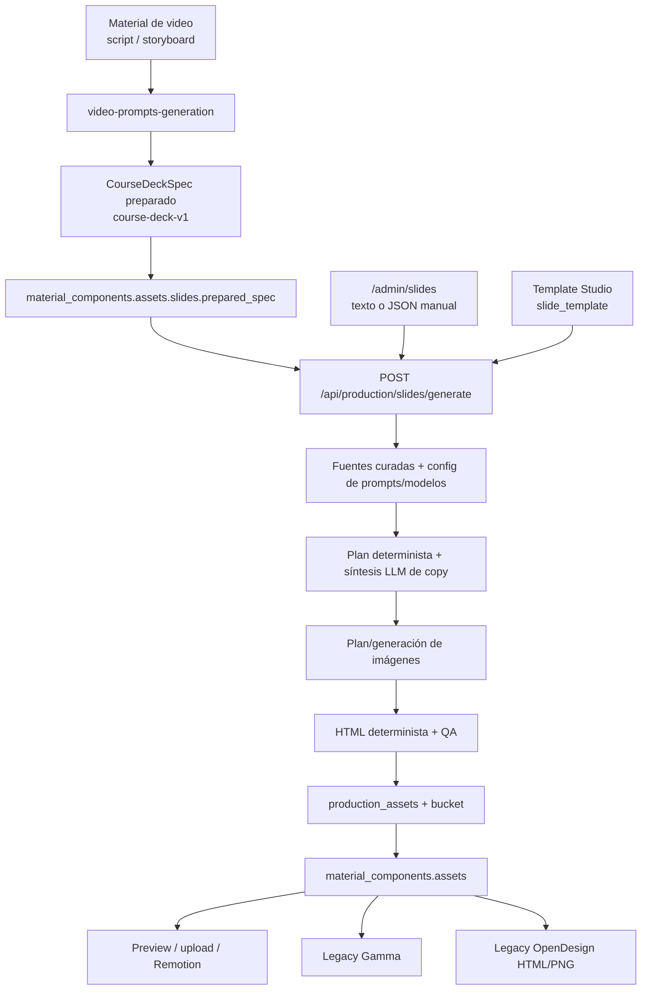

# Mapa del sistema actual de SofLIA - Engine

## Vista general

## Flujo integrado en el pipeline

### 1. Origen de contenido

**[CÓDIGO]** El flujo parte de un `material_component` de video con `content.script` o `content.storyboard`. Los tipos elegibles en `/admin/slides` son `VIDEO_THEORETICAL`, `VIDEO_DEMO` y `VIDEO_GUIDE`.

**Entrada efectiva:** artefacto, lección, componente, guion/storyboard, `source_refs`, fuentes aprobadas y configuración por organización.

### 2. Preparación anticipada desde B-roll

**[CÓDIGO]** `apps/web/netlify/functions/video-prompts-generation.ts` llama a `buildCourseDeckSpecFromComponent` después de generar B-roll. El spec se persiste como `SLIDE_DECK_SPEC` con QA `PENDING` mediante `completeBrollPromptProductionJob` y también se sincroniza a `material_components.assets`.

Esta etapa es determinista: no utiliza los agentes configurables de slides ni el source pack curado para redactar el deck final.

### 3. Generación o regeneración del deck

**[CÓDIGO]** El usuario activa `handleSofliaEngineSlideGeneration` desde la UI de materiales. La llamada usa:

- `componentId` obligatorio;
- `forceRegenerate: true`;
- `locale: es`;
- template `course-module`;
- `slideTemplateRunId` opcional.

La API autentica al usuario, autoriza el componente, resuelve el contexto del pipeline y crea/reutiliza un `production_job` idempotente.

### 4. Evidencia y configuración

`loadSlideSourcePack` busca `curation` por `artifact_id` y hasta 12 filas `curation_rows` aptas, no prohibidas, priorizando fuentes críticas, cobertura completa y referencias del componente. Extrae `content_excerpt` del `validation_report` y construye insights.

`resolveSlideAgentPromptConfig` y `resolveSlideAgentModelConfig` aplican override por organización y fallback global. Los defaults actuales declaran OpenAI primario (`gpt-4o`/`gpt-4o-mini`) y Gemini fallback (`gemini-2.5-flash`).

### 5. Orquestación actual

El orquestador registra los stages:

1. `deck_brief`
2. `evidence_pack`
3. `slide_plan`
4. `visual_direction`
5. `chart_data`
6. `visible_copy_synthesis`
7. `html_render`
8. `quality_gate`

**[CÓDIGO]** Solo `visible_copy_synthesis` invoca Gemini u OpenAI. Los stages brief, evidencia, estrategia, copy base y selección visual son funciones deterministas. Los prompts/modelos de esos stages aparecen en la telemetría, pero no se pasan a una llamada LLM.

**[DISCREPANCIA]** La UI de `/admin/slides` muestra solo seis stages y omite `evidence_pack` y `visible_copy_synthesis`.

### 6. Construcción del spec

Prioridad de contenido en `buildCourseDeckSpecFromComponent`:

1. `customSlides` del usuario;
2. secciones de `content.script`;
3. elementos de `content.storyboard`;
4. slide fallback genérica.

El spec `course-deck-v1` fija 1920×1080, 16:9, 1–24 slides y contiene:

- tipo y orden;
- título, subtítulo, bloques y speaker notes;
- citas y `validationHints`;
- chart declarativo;
- layout y propósito;
- visuales de fondo/apoyo con estado y trazabilidad;
- sistema de diseño y snapshot del origen.

Cuando hay custom slides, la síntesis automática de copy se omite para preservar el texto manual.

### 7. Imágenes

`planDeckVisualAssets` planifica como máximo tres fondos y cuatro visuales de apoyo. Los fondos son decorativos; los visuales de apoyo exigen referencias externas y layouts split. `generateSlideVisualAssets` usa el modelo configurado bajo `SLIDES_IMAGE_GENERATION`, actualmente mediante OpenAI Images, persiste cada imagen como `SLIDE_IMAGE_SET` y conserva checksum, prompt hash, slot y referencias.

Si falta `OPENAI_API_KEY`, la generación se omite; el deck puede continuar sin imágenes listas.

### 8. Render y QA

`renderCourseDeckHtml` produce HTML autocontenido bajo un template confiable. `validateCourseDeckQuality` verifica:

- orden de slides;
- densidad y presupuestos de copy;
- idioma visible;
- contratos y procedencia de gráficas;
- contratos de visuales;
- fuga de narración;
- seguridad HTML;
- correspondencia spec/render.

`FAIL` aborta la generación; `WARN` permite persistir.

### 9. Persistencia y estados

Se suben a `production-assets`:

- `slides/{componentId}-soflia-engine-deck.json`;
- `slides/{componentId}-soflia-engine-deck.html`;
- `slides/{componentId}-soflia-engine-deck.qa.json`;
- imágenes bajo `slides/{componentId}/visuals/...`.

Se insertan filas `production_assets` para spec, HTML, QA e imágenes. El HTML queda `READY_FOR_QA`; otros outputs quedan `GENERATED`. El job termina `SUCCEEDED` o `FAILED`.

También se actualiza el JSON `material_components.assets` con `slides_url`, `prepared_spec`, rutas, QA, template seleccionado y `production_status: DECK_READY`.

**[CÓDIGO]** No se encontró una acción específica de aprobación/rechazo para assets de deck que avance `production_assets.qa_status` a `APPROVED` o `REJECTED`.

### 10. Consumo por producción de video

Un HTML subido o generado puede pasar por `/api/production/slides/animated-deck/prepare`. El preprocesador:

- extrae `<section class="slide">`;
- elimina scripts, controladores y event handlers;
- importa imágenes HTTPS o crea placeholders;
- limita tamaño, fuentes y número de slides;
- produce `animated-deck-v1` para Remotion;
- persiste `deck.json` y estado `READY_FOR_RENDER` o `FAILED` dentro de `material_components.assets.slides.animated_deck`.

Este adaptador es útil, pero confirma que el deck existe principalmente como insumo de ensamblado.

## Superficie administrativa “independiente”

Ruta: `apps/web/src/app/admin/slides/page.tsx`.

Capacidades confirmadas:

- listar componentes de video recientes;
- mostrar QA recientes desde `production_assets`;
- usar contenido existente del componente;
- reemplazarlo por texto simple o `customSlides` JSON;
- introducir título/subtítulo;
- abrir el HTML generado.

Limitaciones:

- exige `componentId` incluso en modo manual;
- el selector se alimenta de materiales del pipeline;
- la autorización y persistencia siguen ligadas a artefacto/lección/componente;
- no crea un proyecto independiente;
- no conserva revisiones ni edición slide por slide;
- no permite reanudar una conversación agéntica;
- no expone aprobación del deck ni reparación automática de findings.

**Conclusión:** es una entrada alternativa al mismo motor acoplado, no un módulo independiente.

## Skill y flujo de plantillas fuera del pipeline

### Skill `soflia-deck`

`apps/web/src/domains/production/slides/templates/soflia-deck/soflia-deck.skill.md` prescribe crear HTML autocontenido clonando `example.html`, conservar tokens y animaciones y emitir `<artifact ...>`. Su manifiesto define triggers, vocabulario visual y contrato HTML.

**[CÓDIGO]** El skill no constituye por sí solo un runtime de proyectos o un orquestador. Es una instrucción/plantilla versionada. Existe además una copia de distribución en `items/soflia-deck-SKILL.md`.

**[DISCREPANCIA]** El manifiesto de template declara input con `audience` y `learningObjective`, pero `slideDeckGenerateInputSchema` de la API no acepta esos campos.

### Slide Template Studio

`/admin/slides/templates` reutiliza el bundle-agent para conversaciones, specs versionadas y runs. Produce paquetes `slide_template` ZIP con blueprint, tokens, modificadores, layouts y tipos de slide. Un run `PACKAGED` puede seleccionarse al generar un deck; la API solo aplica su sistema de diseño y slots visuales.

Este flujo sí es independiente del contenido de un curso, pero genera **plantillas**, no presentaciones completas. Su modelo de conversaciones/specs/versiones es un antecedente valioso para el futuro módulo.

## Rutas legacy y duplicaciones

### Gamma

**[CÓDIGO]** La integración actual es manual: copia el contenido al portapapeles y abre `https://gamma.app/create`; el usuario pega una URL después. No se encontró llamada a Gamma API en el flujo revisado. `gamma_deck_id` se genera localmente.

**[DISCREPANCIA]** La documentación histórica y `AGENTS.md` describen Gamma API y export PNG como parte del pipeline, pero el código actual observado implementa una transferencia manual.

### Exportador denominado OpenDesign

`/api/production/open-design/export` no llama a OpenDesign. Construye un HTML fijo y PNG simples con SVG + Sharp a partir del storyboard/script, y actualiza `material_components.assets.slides.images`.

**[DISCREPANCIA]** El nombre del endpoint y `open_design_project_id` sugieren integración externa, pero el comportamiento es un generador interno legacy.

### Subidas manuales

La UI admite ZIP, HTML e imágenes, además de importación Drive/OneDrive. Un HTML se prepara para Remotion; un paquete sin imágenes puede activar el exportador legacy. Estos caminos son útiles como ingestión, pero repiten lógica de generación y estado.

## Edición, regeneración, aprobación y exportación

| Capacidad | Estado actual |
|---|---|
| Editar contenido | Texto/JSON previo a generar; edición externa de HTML/archivos subidos. No hay editor estructurado de la IR. |
| Regenerar | Regeneración completa con UUID y `forceRegenerate`; las rutas finales se sobrescriben. |
| Regenerar una slide | No se encontró contrato/API específico. |
| Versionar | Jobs y assets dejan historial, pero el path canónico del archivo y `material_components.assets` apuntan a la última versión; no existe entidad explícita `deck_version`. |
| QA automático | Sí, determinista y bloqueante para `FAIL`. |
| QA visual renderizado | No se encontró captura/visión como gate del generador principal. |
| Aprobación humana | El modelo de `production_assets` la permite, pero no se encontró flujo de deck que la opere. |
| Export HTML | Sí. |
| Export PNG | Sí por el exportador legacy o uploads; no deriva necesariamente de la IR final. |
| Export PDF/PPTX | No confirmado. |
| Export Remotion | Preparación a `animated-deck-v1`; después lo consume producción. |

## Autonomía actual

El motor automatiza fuentes, planificación base, copy, imágenes, render, QA y persistencia. Aun requiere intervención humana para:

- escoger el componente;
- iniciar generación/regeneración;
- escoger template;
- aportar custom slides;
- corregir un `FAIL` que no tenga recuperación automática;
- revisar calidad semántica/visual;
- manejar Gamma y uploads externos;
- decidir si el resultado se usa en video.

No existe un agente supervisor que observe findings, decida una reparación localizada, vuelva a renderizar y escale solo cuando excede sus límites.

