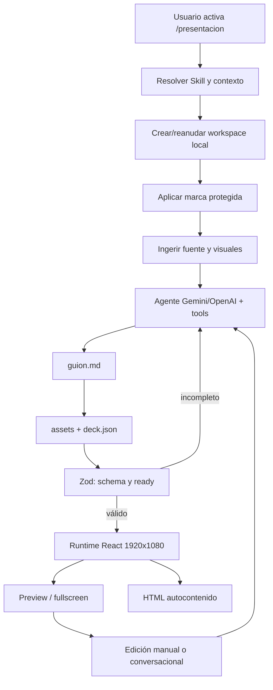

# Mapa del sistema de Pulse Hub

## Relación entre `prompt_maestro.md` y el flujo real

| Fuente | Qué afirma | Relación con slides |
|---|---|---|
| `docs/prompt_maestro.md` | Es un alias vigente de `docs/standards/engineering-practices.md`. | No contiene el flujo de slides. |
| `docs/standards/engineering-practices.md` | Exige separación UI/orquestación/persistencia, IPC en cuatro capas, seguridad, HITL, trazabilidad y verificación. | Marco arquitectónico general. |
| `ai-specs/skills/presentaciones-hyperframes-react/SKILL.md` | Define el flujo HyperFrames + React, `guion.md`, `deck.json`, uso de visuales de fuente y reglas duras. | Guía específica de desarrollo/operación de la Skill. |
| `src/prompts/skills/presentaciones.ts` | Define el prompt runtime actual que recibe el modelo. | Contrato ejecutable principal del agente. |
| `src/shared/presentations/deck-schema.ts` | Define el schema estricto que acepta el runtime. | Fuente de verdad técnica de la IR. |

**[DISCREPANCIA]** El encargo trata `prompt_maestro.md` como fuente principal específica; el repositorio lo trata como alias general. Este mapa no sustituye una por otra: registra la cadena completa.

## Flujo principal: Skill de presentaciones en escritorio

### 1. Activación y contexto

La Skill `sistema:presentaciones` está registrada en código, habilitada por defecto y expuesta a chat, WhatsApp y Telegram, aunque sus capacidades concretas difieren por superficie. Se activa por catálogo o `/presentacion`.

`prepareSkillWorkspace` recupera el workspace asociado a la conversación o crea uno nuevo. Antes de la llamada al modelo, `buildPresentacionesContextNote` clasifica el turno según conversación previa, adjuntos o página visible y comunica la disponibilidad de branding.

### 2. Intake y HITL documentado

**[DOCUMENTADO]** El prompt obliga a identificar tema, audiencia, objetivo y fuentes; si falta una decisión material, debe preguntar. La versión legacy del mismo archivo prescribe además:

- confirmar el enfoque cuando el usuario aporta contenido;
- leer la página actual antes de preguntar si ya está disponible;
- investigar y presentar un outline de 10–18 slides para aprobación cuando la información se obtiene mediante investigación.

**[DISCREPANCIA]** El prompt runtime nuevo conserva la identificación de contexto y la regla de preguntar por decisiones materiales, pero ya no contiene de forma explícita todos los casos A–D ni la aprobación obligatoria del outline investigado que sí aparecen en `PRESENTACIONES_LEGACY_PROMPT`. Esa constante legacy se neutraliza con `void PRESENTACIONES_LEGACY_PROMPT`.

### 3. Workspace y herramientas

El workspace vive bajo `app.getPath('userData')/skill-workspaces`, con índice `workspaces.json`. La política de Presentaciones establece:

- root `presentaciones`;
- `deck.json` como entry file;
- extensiones `.json` y `.md` para texto del modelo;
- máximo 512 KB por archivo y 8 MB por workspace;
- `estilos/marca.css` protegido;
- imágenes admitidas por una ruta separada y con límite propio.

Herramientas del agente:

- `workspace_list_files`;
- `workspace_read_file`;
- `workspace_write_file`;
- `workspace_edit_file`;
- `workspace_generate_image`;
- `workspace_download_image`.

La capa renderer inyecta el `workspaceId`; el modelo no puede escoger otro workspace. Main valida contención, paths, extensiones, archivos protegidos, cantidad de archivos y presupuesto total.

### 4. Fuentes y recursos visuales

`preparePresentationSourceVisuals` materializa hasta ocho visuales de adjuntos/página antes de llamar al modelo: hasta cuatro inline y cinco web, ordenados por alt y tamaño. Devuelve rutas locales y un manifiesto marcado como contenido no confiable.

El prompt ordena:

- priorizar imágenes/gráficas documentales de la fuente;
- no recrearlas con IA;
- generar solo complementos conceptuales;
- mantener una dirección de arte común;
- usar imágenes significativas en 40–60% de decks de ocho o más slides;
- no repetir un recurso más de dos veces.

**Fortaleza:** separa adquisición de assets de su referencia en la IR y evita depender de URLs remotas durante la presentación.

### 5. Plan narrativo e IR

El agente debe escribir primero `guion.md` con una fila por slide: mensaje, evidencia, arquetipo, visual y continuidad. El único entregable renderizable es después `deck.json` versión 1.

La IR admite de 3 a 30 slides y nueve arquetipos:

- `portada`;
- `declaracion`;
- `division`;
- `comparacion`;
- `proceso`;
- `metricas`;
- `grafica`;
- `cita`;
- `cierre`.

También limita tamaños de texto, cantidad de puntos, series/categorías, rutas de imágenes y vocabulario de movimiento. Prohíbe repetir la mayoría de arquetipos consecutivamente.

**Fortaleza:** la IR no permite HTML/CSS/JS/JSX ni coordenadas libres. El agente decide semántica y coreografía; React decide geometría.

**Debilidad:** `fuente` es un texto visible opcional y `meta.fuentes` contiene metadatos generales; no existe un mapping fuerte claim → sourceRef comparable con `validationHints` de SofLIA - Engine.

### 6. Bucle agéntico y criterio de salida

Los pipelines Gemini y OpenAI exponen herramientas solo cuando la Skill activa las declara. En OpenAI, un workspace aumenta el límite a 20 iteraciones y 32,768 tokens de salida. El loop compacta llamadas y resultados previos para controlar el presupuesto.

Cuando el modelo intenta cerrar:

1. `inspectWorkspaceCompletion` consulta el estado real del workspace;
2. `SkillWorkspaceService.isEntryReady` exige que exista `deck.json`;
3. parsea JSON y aplica `presentationDeckSchema`;
4. si falla, el loop reinyecta `WORKSPACE_REPAIR_INSTRUCTION` para continuar;
5. si se agotan iteraciones, informa que el deck quedó incompleto.

Este es el patrón agéntico más reutilizable para SofLIA - Engine: una afirmación del modelo no sustituye el estado verificable del entregable.

### 7. Branding

Main resuelve organización, descarga logo/banner y construye `estilos/marca.css`. Si no hay paleta explícita, puede extraerla del logo y ajustarla a contraste 4.5. El archivo es protegido y el modelo no puede editarlo.

El runtime React consume las variables; el deck no copia hexadecimales de marca. Esta separación evita drift y prompt injection visual.

### 8. Runtime, preview y exportación

`PresentationRuntimeServer` sirve por loopback:

- `deck.json`;
- `estilos/marca.css`;
- `assets/`;
- bundle del renderer.

Usa tokens opacos por workspace, CSP, allowlist de recursos y no expone paths absolutos. El preview se abre en `iframe sandbox="allow-scripts"` sin `allow-same-origin`.

`PresentationPlayerApp`:

- usa canvas fijo 1920×1080;
- renderiza arquetipos con React/Tailwind;
- aplica continuidad y entradas con Framer Motion;
- respeta `prefers-reduced-motion`;
- usa Recharts para gráficas;
- permite teclado, rueda y botones;
- muestra progreso y fuentes/pie.

`exportPresentationDeckToHtml` empaqueta deck, CSS, imágenes y bundle en un único HTML autocontenido de hasta 12 MB.

No se confirmó exportación PDF o PPTX dentro del flujo principal de la Skill React.

### 9. Edición y reanudación

El panel muestra archivos, código, imágenes y preview. El usuario puede editar texto y guardar; el agente puede leer y aplicar reemplazos exactos. `resolveTurnSkill` recupera la Skill desde el workspace de la conversación para que un follow-up pueda editar el mismo deck.

Limitaciones:

- no hay historial de revisiones;
- guardar sobrescribe el archivo;
- no hay edición visual WYSIWYG;
- no hay colaboración ni sync remota;
- el workspace pertenece a una conversación, no a una entidad de negocio compartible.

## Validación y calidad

### Confirmado

- schema Zod estricto;
- IDs únicos;
- compatibilidad de series/categorías;
- alternancia de arquetipos;
- paths locales de imágenes;
- preview en canvas fijo;
- reglas de diseño y evidencia en prompt;
- obligación de releer `deck.json` antes de cerrar.

### No confirmado como gate

- fidelidad factual claim por claim;
- links/fuentes accesibles;
- cobertura de objetivo;
- densidad real por bounding boxes;
- overflow o clipping;
- contraste del contenido final;
- coherencia visual observada por visión;
- reparación automática guiada por un reporte visual.

### Discrepancia del badge visual

`PresentationPreview.tsx` escucha `pulse-presentacion-calidad`. El único emisor encontrado está en `electron/organization-branding/deck-base-js.ts`, una capa que `presentation-system-refresh.ts` declara exclusiva de presentaciones HTML heredadas y que no se inyecta en workspaces `deck.json`.

**[INFERENCIA]** El runtime React actual probablemente no alimenta el badge. Requiere validación dinámica.

## Flujos alternativos y legacy

### Workflow WhatsApp con aprobación

`electron/presentation-workflow/workflow.ts` implementa:

`AWAITING_DATA → PROCESSING_PROPOSAL → AWAITING_APPROVAL → GENERATING_PRESENTATION → COMPLETED`.

Solicita empresa/email, genera propuesta, exige “sí” y después entrega un archivo. Este HITL explícito es reutilizable.

### Contradicción HTML vs `deck.json`

`generatePresentationForWhatsApp` crea el workspace con la política actual de la Skill (`entryFile: deck.json`), pero `generateHtml` ordena al modelo devolver `index.html` completo y después escribe ese HTML en el entry file. Luego llama a `exportPresentationToHtml` usando ese entry file.

**[DISCREPANCIA]** La política, el readiness y el runtime esperan JSON, mientras esta ruta escribe HTML. Los comentarios también alternan entre “exporta a PDF” y “entrega HTML”.

**[INFERENCIA]** Si esta ruta se ejecuta con la política actual, el workspace no debería pasar `parsePresentationDeck`. Debe verificarse su alcance real y si existe configuración remota que lo evita.

### Generador de documentos PDF

`create_document` acepta `pptx`, `powerpoint` o `presentacion`, pero llama a `createPresentationPDF` y devuelve un `.pdf`. Tiene fallback entre `presentation-premium` y `presentation-pdf`.

**[DISCREPANCIA]** El nombre de entrada sugiere PPTX, pero la salida confirmada es PDF. Es un generador distinto al runtime `deck.json` y no conserva su IR ni movimiento.

## Persistencia y estados

El flujo principal no usa Supabase para decks:

- índice local `workspaces.json`;
- archivos dentro de `skill-workspaces`;
- asociación opcional a `conversationId`;
- readiness calculado, no persistido como workflow detallado;
- eventos de progreso en memoria para UI.

Estados funcionales observables: workspace creado, archivos en escritura/error, `ready` válido, preview/fullscreen/export. No hay estados durables equivalentes a `DRAFT`, `READY_FOR_QA`, `APPROVED` o `EXPORTED`.

## Autonomía actual

Pulse Hub tiene mayor autonomía operativa porque el modelo puede:

- inspeccionar contexto;
- escribir y corregir múltiples archivos;
- adquirir/generar visuales;
- reanudar una edición;
- ser obligado por el sistema a completar un output válido.

La autonomía aún depende de intervención humana o de reglas del prompt para:

- confirmar contexto ambiguo;
- aprobar outline investigado en el contrato legacy;
- juzgar calidad visual real;
- validar afirmaciones de negocio;
- decidir publicación/entrega externa;
- recuperar rutas WhatsApp legacy inconsistentes.

