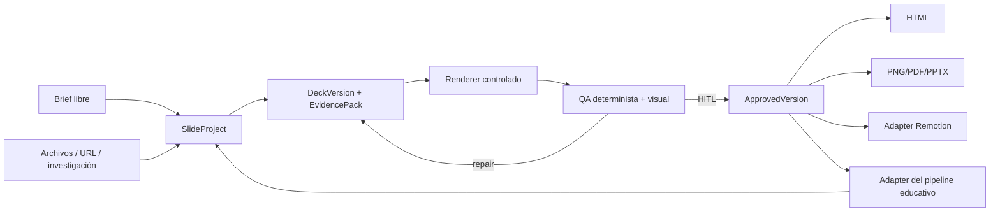
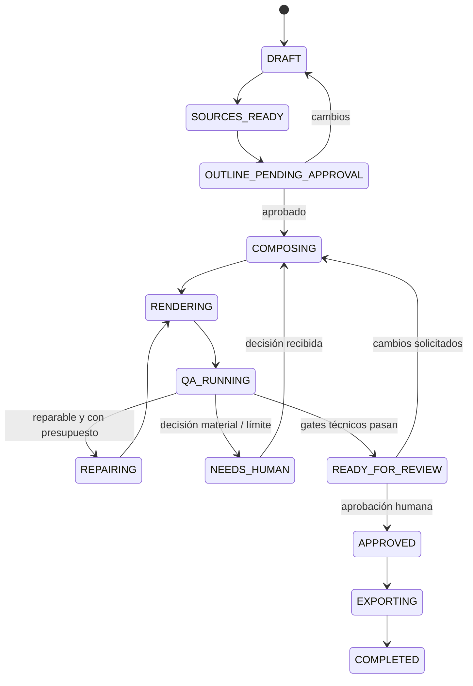

# Propuesta conceptual para el módulo independiente y agéntico

Todo este documento es **[RECOMENDACIÓN]** y no describe funcionalidad ya implementada, salvo las referencias explícitas a contratos actuales usadas como punto de partida.

## Principio rector

**[RECOMENDACIÓN]** El futuro módulo debe ser propietario de proyectos y versiones de presentación; el pipeline de cursos debe ser solo una fuente de contexto y un consumidor de builds aprobados.

## Responsabilidades del módulo

### Debe poseer

1. **Proyecto:** identidad, tenant, título, propósito, audiencia, idioma, estado y política.
2. **Fuentes:** documentos, URLs, referencias del pipeline y snapshots normalizados.
3. **Evidencia:** claims, citas, datos, visuales de fuente y relación con slides.
4. **Brief y outline:** tesis, arco narrativo, objetivo, número objetivo y gate humano.
5. **Deck IR:** contenido semántico, notas, layouts/arquetipos, movimiento y design tokens.
6. **Versiones:** parent, motivo del cambio, autor humano/agente, diff y estado.
7. **Assets:** originales, generados, derivados, hashes, licencia/procedencia y alt text.
8. **Builds:** renderer, formato, versión, checksum, logs y paths.
9. **QA:** reportes estructurales, factuales, visuales y de accesibilidad.
10. **Aprobación:** quién, cuándo, qué versión y con qué excepciones.
11. **Conversaciones/ejecuciones:** trazas del agente, tools, presupuesto y resultado.

### No debe poseer

- syllabus, materiales o estado global del curso;
- lógica de ensamblado de video;
- publicación de cursos;
- autenticación general de la plataforma;
- implementación de proveedores de IA compartidos;
- UI específica de Gamma, Remotion o un consumidor concreto;
- contenido fuente mutable de otros dominios.

## Modelo conceptual

| Agregado/objeto | Propósito |
|---|---|
| `SlideProject` | Contenedor independiente y durable. |
| `SlideProjectLink` | Vínculo opcional con artefacto, lección, material, conversación o sistema externo. |
| `SourceSnapshot` | Copia identificable de la fuente usada en una ejecución. |
| `EvidenceClaim` | Afirmación/dato con source refs, excerpt y nivel de confianza. |
| `DeckBrief` | Objetivo, audiencia, tesis, tono, restricciones y criterios de éxito. |
| `DeckOutline` | Secuencia de mensajes antes del diseño detallado. |
| `DeckVersion` | IR inmutable versionada. |
| `DeckAsset` | Recurso fuente, generado o derivado con provenance. |
| `DeckBuild` | Output generado desde una versión concreta. |
| `QaRun` | Resultado por gate y renderer. |
| `ApprovalDecision` | Decisión humana durable con notas/excepciones. |
| `AgentRun` | Plan, tools, iteraciones, costes, errores y outcome. |

No se propone aquí una migración ni nombres definitivos de tablas; son límites de dominio para validar antes del diseño físico.

## Fuente canónica

La fuente canónica debe ser `DeckVersion`, no HTML, PNG ni `material_components.assets`.

### Contenido mínimo de la IR

- metadata: objetivo, audiencia, locale, perfil de deck;
- design system versionado y protegido;
- slides con ID estable, orden y arquetipo;
- copy visible, notes y call-to-action;
- bloques semánticos tipados;
- chart/diagram spec declarativo;
- evidence refs y must-keep claims;
- asset slots y referencias;
- motion intent acotada;
- accessibility metadata;
- provenance de generación y schema version.

**Decisión recomendada:** evolucionar `course-deck-v1` en vez de adoptar `deck.json` de Pulse Hub sin cambios. El primero ya contiene evidencia, notas y visual assets; debe incorporar arquetipos/motion estrictos y separar IDs del pipeline.

## Arquitectura lógica

### 1. Core de dominio

Funciones puras y schemas:

- validar IR;
- aplicar operaciones semánticas sobre una versión;
- calcular diff;
- resolver compatibilidad de template;
- producir reportes QA deterministas;
- declarar contratos de tools.

### 2. Orquestador de aplicaciones

Casos de uso explícitos:

- crear proyecto;
- ingerir fuente;
- proponer brief/outline;
- generar versión;
- editar/regenerar selección;
- renderizar;
- validar/reparar;
- aprobar;
- exportar;
- vincular/entregar al pipeline.

### 3. Adaptadores

- **Course pipeline adapter:** transforma artifact/lesson/component/curation en un context pack y recibe un build aprobado.
- **Manual brief adapter:** formulario/chat/JSON.
- **Document/web adapter:** extracción y snapshot.
- **Asset adapter:** storage, imágenes de fuente y generación.
- **Model adapter:** Gemini/OpenAI u otros según settings.
- **Renderer adapter:** HTML React/estático, raster, PDF/PPTX futuro.
- **Video adapter:** convierte un build aprobado a entradas de Remotion.

### 4. Superficies

- biblioteca de proyectos;
- workspace de autoría;
- outline y evidence review;
- editor de slides;
- preview + QA;
- versiones/diff;
- exportaciones y vínculos.

## Relación con el pipeline actual

### Crear desde el pipeline

1. El pipeline construye un `CourseSlideContext` con IDs y snapshots.
2. El módulo crea un `SlideProject` independiente y un `SlideProjectLink`.
3. El agente usa fuentes/guion/storyboard mediante tools del adapter.
4. La versión aprobada genera el build requerido.
5. El pipeline guarda solo el vínculo y el build seleccionado; no copia la IR completa dentro de `material_components.assets`.

### Crear fuera del pipeline

1. El usuario inicia un proyecto sin artefacto.
2. Aporta brief, archivos, URL o autorización de investigación.
3. El mismo core produce y valida la versión.
4. Más adelante el proyecto puede vincularse a una lección o utilizarse en otro contexto.

### Actualizaciones

- Un cambio de material no sobrescribe automáticamente una versión aprobada.
- El adapter marca el vínculo como `SOURCE_CHANGED` y propone crear una versión nueva.
- Un cambio del deck marca builds dependientes como stale.
- Video consume un build inmutable, no “la última URL”.

## Diseño del flujo agéntico

### Roles lógicos

No es obligatorio usar un modelo distinto por rol. Son responsabilidades y tools auditables:

1. **Intake/brief:** identifica objetivo, audiencia, formato y restricciones.
2. **Source curator:** materializa fuentes y evidence claims.
3. **Narrative planner:** propone tesis y outline.
4. **Slide composer:** crea/edita la IR con operaciones tipadas.
5. **Visual director:** asigna assets, charts, layouts y movimiento.
6. **Renderer:** tool determinista.
7. **QA critic:** combina validators, render metrics y visión.
8. **Repair planner:** convierte findings en patches localizados.
9. **Supervisor:** aplica presupuestos, gates y escalamiento.

### Tools recomendadas

| Tool | Tipo | Decisión que habilita |
|---|---|---|
| `get_project_context` | Lectura | Saber qué existe y qué está vinculado. |
| `ingest_source` | Efecto controlado | Crear snapshot y evidencia. |
| `list_evidence` | Lectura | Redactar sin inventar. |
| `propose_brief` / `propose_outline` | Operación de dominio | Crear candidato aprobable. |
| `create_deck_version` | Mutación versionada | Generar sin sobrescribir. |
| `patch_slide` / `reorder_slides` | Mutación localizada | Editar conservando IDs. |
| `plan_assets` | Determinista | Seleccionar slots/procedencia. |
| `generate_asset` | Proveedor externo | Crear complemento con coste. |
| `render_build` | Determinista | Obtener output real. |
| `run_structural_qa` | Determinista | Validar contratos. |
| `run_visual_qa` | Renderer/visión | Detectar overflow, contraste y monotonía. |
| `apply_repair_plan` | Mutación versionada | Corregir findings concretos. |
| `request_human_decision` | HITL | Escalar decisión material. |
| `approve_version` | Solo humano | Congelar una versión para consumo. |
| `export_build` | Efecto | Producir formato solicitado. |
| `link_pipeline_consumer` | Adapter | Entregar sin acoplar el core. |

### Máquina de estados sugerida

Los estados de proyecto, versión, agent run y build no deben mezclarse. Por ejemplo, un agent run puede fallar sin que el proyecto deje de ser editable.

## Validaciones recomendadas

### Deterministas antes de render

- schema, IDs, orden y referencias;
- límites de copy y arquetipo;
- idioma;
- evidencia requerida para claims/datos;
- compatibilidad template/layout;
- paths, MIME, tamaño, checksum y alt text;
- scripts/URLs prohibidos;
- chart data y source refs;
- accesibilidad básica.

### Basadas en render

- overflow/clipping;
- bounding boxes fuera de canvas;
- texto demasiado pequeño;
- contraste efectivo;
- assets rotos;
- densidad y repetición de composición;
- consistencia de marca;
- safe areas para video/avatar;
- primera/última frame con movimiento reducido.

### Semánticas/LLM

- cobertura de objetivo;
- coherencia del arco;
- redundancia;
- fidelidad a evidence claims;
- calidad y especificidad del copy;
- correspondencia entre visual y mensaje.

Un gate LLM nunca debe sustituir las comprobaciones deterministas.

## Política de reparación

- Máximo configurable de ciclos por versión.
- Cada ciclo recibe findings estructurados, no una captura sin diagnóstico.
- Se aplican patches localizados sobre slides afectadas.
- Cada reparación crea una versión hija o un revision draft auditable.
- No regenerar assets caros si el finding es de copy/layout.
- Escalar cuando la solución cambie tesis, datos, identidad o alcance.
- Detenerse ante falta de evidencia en vez de inventar.

## HITL recomendado

| Punto | Gate humano |
|---|---|
| Intake | Solo si audiencia/objetivo/fuente cambian materialmente el resultado. |
| Investigación externa | Aprobar outline y evidencia crítica antes de componer. |
| Fuente insuficiente | Elegir completar, reducir alcance o aceptar placeholders. |
| Branding | Confirmar excepciones, no cada uso normal de tokens. |
| Coste | Aprobar si generación de assets excede presupuesto. |
| QA | Resolver findings no reparables o excepciones. |
| Final | Aprobar una versión exacta antes de publicar/entregar al pipeline. |
| Efecto externo | Confirmar envío, publicación o reemplazo de una versión consumida. |

## Fases sugeridas de evolución

### Fase 0 — Alinear contratos

- declarar qué camino es canónico;
- catalogar legacy Gamma/OpenDesign;
- corregir nomenclatura de agentes/prompts;
- definir IR objetivo y ownership.

### Fase 1 — Independencia y versionado

- introducir `SlideProject`, links y versiones;
- adaptar el generador actual sin cambiar su renderer;
- eliminar IDs de pipeline del core;
- conservar compatibilidad mediante adapter.

### Fase 2 — Workspace de autoría

- biblioteca, editor estructurado, preview y diff;
- conversación vinculada al proyecto;
- custom input convertido a operaciones sobre IR;
- aprobación durable.

### Fase 3 — Orquestador agéntico

- tool catalog server-side;
- brief/outline/evidence;
- supervisor con budgets;
- completion gates más allá de existencia.

### Fase 4 — QA y reparación

- render worker reproducible;
- métricas visuales y capturas;
- critic multimodal;
- repair loop localizado;
- observabilidad/costes.

### Fase 5 — Exportación y ecosistema

- HTML, PNG, PDF/PPTX según decisión de producto;
- adaptador Remotion estable;
- templates/plugins versionados;
- publicación y reutilización entre módulos.

## Decisiones humanas pendientes

- audiencia primaria del módulo: educación, ejecutivas o ambos mediante perfiles;
- formatos de exportación de primera clase;
- si el HTML debe ser público, firmado o privado;
- política de investigación y fuentes permitidas;
- SLA, presupuesto y límites por deck;
- granularidad de versionado y retención;
- modelo de permisos/colaboración;
- compatibilidad con decks legacy;
- renderer canónico: evolución del actual HTML Engine, React compartido o ambos bajo la misma IR;
- qué gates pueden autoaprobarse y cuáles requieren siempre un humano.
